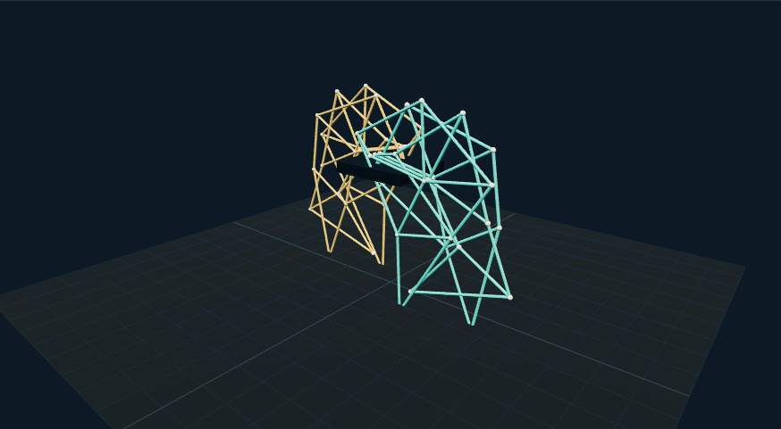

# Three.js 实验室

43 个可以操作的图形实验，覆盖机构运动、科学形态、状态界面与空间交互。每个例子有独立路由、控件、运行读数和研究文档。

[打开实验目录](https://weisiwu.github.io/threejs-demo/) · [阅读网站专题](https://imgen.baoganai.com/knowledge/read/dilum-sanjaya-analysis-index)



实现使用 TypeScript、Three.js 和 Vite。状态管理实验单独使用 React；大部分场景直接维护 Three.js 对象。模型与材质由代码生成，蛋白质目标态使用 RCSB 1CRN 的 Cα 坐标。没有 API 密钥、付费模型调用或原帖媒体。

这些实验用于检查文章所讨论的机制。它们是按公开资料独立编写的机制复现；生成资产、原作完整视觉和科学求解仍有明确缺口，逐篇记录在研究文档中。

## 本地运行

```bash
npm ci
npm run dev
```

浏览器打开终端给出的 /threejs-demo/ 地址。构建用 `npm run build`，机制检查用 `npm test`，目录检查用 `npm run check:catalog`。

端到端检查：

```bash
npm run test:e2e
```

本机配置使用 Chrome；CI 安装 Chromium。若在无 Chrome 的本机运行，可用 `CI=1 npx playwright install chromium` 后执行 `CI=1 npm run test:e2e`。

## 实验目录

| 实验 | 方向 | 实现记录 |
| --- | --- | --- |
| [可定制仪表盘](https://weisiwu.github.io/threejs-demo/#/demo/customizable-dashboard) | 界面与状态 | [研究与源码](docs/customizable-dashboard.md) |
| [状态订阅实验](https://weisiwu.github.io/threejs-demo/#/demo/state-management) | 界面与状态 | [研究与源码](docs/state-management.md) |
| [太阳系场景搭建](https://weisiwu.github.io/threejs-demo/#/demo/solar-system-basics) | 科学可视化 | [研究与源码](docs/solar-system-basics.md) |
| [轨道与交互](https://weisiwu.github.io/threejs-demo/#/demo/solar-system-orbits) | 科学可视化 | [研究与源码](docs/solar-system-orbits.md) |
| [可见性仪表盘](https://weisiwu.github.io/threejs-demo/#/demo/visibility-dashboard) | 界面与状态 | [研究与源码](docs/visibility-dashboard.md) |
| [网络运维控制台](https://weisiwu.github.io/threejs-demo/#/demo/network-management) | 界面与状态 | [研究与源码](docs/network-management.md) |
| [场景指令工作台](https://weisiwu.github.io/threejs-demo/#/demo/scene-builder) | 生成与资产 | [研究与源码](docs/scene-builder.md) |
| [六足步态实验](https://weisiwu.github.io/threejs-demo/#/demo/hexapod-robot) | 机械机构 | [研究与源码](docs/hexapod-robot.md) |
| [喷气发动机粒子](https://weisiwu.github.io/threejs-demo/#/demo/jet-engine) | 机械机构 | [研究与源码](docs/jet-engine.md) |
| [步行连杆机构](https://weisiwu.github.io/threejs-demo/#/demo/strandbeest) | 机械机构 | [研究与源码](docs/strandbeest.md) |
| [柔性链条追踪](https://weisiwu.github.io/threejs-demo/#/demo/kinematic-creature) | 机械机构 | [研究与源码](docs/kinematic-creature.md) |
| [DNA 点云](https://weisiwu.github.io/threejs-demo/#/demo/dna-structure) | 科学可视化 | [研究与源码](docs/dna-structure.md) |
| [元素相态卡片](https://weisiwu.github.io/threejs-demo/#/demo/periodic-table) | 科学可视化 | [研究与源码](docs/periodic-table.md) |
| [极光叙事时间轴](https://weisiwu.github.io/threejs-demo/#/demo/aurora) | 科学可视化 | [研究与源码](docs/aurora.md) |
| [异常监测台](https://weisiwu.github.io/threejs-demo/#/demo/anomaly-monitor) | 界面与状态 | [研究与源码](docs/anomaly-monitor.md) |
| [骨骼结构浏览器](https://weisiwu.github.io/threejs-demo/#/demo/skeleton-explorer) | 生成与资产 | [研究与源码](docs/skeleton-explorer.md) |
| [角色选择大厅](https://weisiwu.github.io/threejs-demo/#/demo/character-selection) | 游戏与空间 | [研究与源码](docs/character-selection.md) |
| [扑翼机构](https://weisiwu.github.io/threejs-demo/#/demo/ornithopter) | 机械机构 | [研究与源码](docs/ornithopter.md) |
| [飞船整备舱](https://weisiwu.github.io/threejs-demo/#/demo/ship-selection) | 游戏与空间 | [研究与源码](docs/ship-selection.md) |
| [销量数据时间轴](https://weisiwu.github.io/threejs-demo/#/demo/sales-timeline) | 科学可视化 | [研究与源码](docs/sales-timeline.md) |
| [机械臂 IK 工作站](https://weisiwu.github.io/threejs-demo/#/demo/industrial-arm) | 机械机构 | [研究与源码](docs/industrial-arm.md) |
| [三维地形探索](https://weisiwu.github.io/threejs-demo/#/demo/world-environment) | 游戏与空间 | [研究与源码](docs/world-environment.md) |
| [智能家居沙盘](https://weisiwu.github.io/threejs-demo/#/demo/smart-home) | 界面与状态 | [研究与源码](docs/smart-home.md) |
| [交互地图实验](https://weisiwu.github.io/threejs-demo/#/demo/interactive-map) | 界面与状态 | [研究与源码](docs/interactive-map.md) |
| [未来控制界面](https://weisiwu.github.io/threejs-demo/#/demo/futuristic-interface) | 界面与状态 | [研究与源码](docs/futuristic-interface.md) |
| [机器人图鉴](https://weisiwu.github.io/threejs-demo/#/demo/robot-roster) | 生成与资产 | [研究与源码](docs/robot-roster.md) |
| [行星探索台](https://weisiwu.github.io/threejs-demo/#/demo/planet-explorer) | 科学可视化 | [研究与源码](docs/planet-explorer.md) |
| [时空网格示意](https://weisiwu.github.io/threejs-demo/#/demo/black-hole) | 科学可视化 | [研究与源码](docs/black-hole.md) |
| [生物形态浏览器](https://weisiwu.github.io/threejs-demo/#/demo/biological-structure) | 生成与资产 | [研究与源码](docs/biological-structure.md) |
| [涡扇气流分支](https://weisiwu.github.io/threejs-demo/#/demo/turbofan-airflow) | 机械机构 | [研究与源码](docs/turbofan-airflow.md) |
| [原子表示实验](https://weisiwu.github.io/threejs-demo/#/demo/atomic-explorer) | 科学可视化 | [研究与源码](docs/atomic-explorer.md) |
| [分子图与空间结构](https://weisiwu.github.io/threejs-demo/#/demo/molecular-structure) | 科学可视化 | [研究与源码](docs/molecular-structure.md) |
| [电路网表工作台](https://weisiwu.github.io/threejs-demo/#/demo/circuit-builder) | 生成与资产 | [研究与源码](docs/circuit-builder.md) |
| [反应堆诊断台](https://weisiwu.github.io/threejs-demo/#/demo/reactor-diagnostics) | 界面与状态 | [研究与源码](docs/reactor-diagnostics.md) |
| [动态花瓣亭](https://weisiwu.github.io/threejs-demo/#/demo/kinetic-pavilion) | 机械机构 | [研究与源码](docs/kinetic-pavilion.md) |
| [规则图演化](https://weisiwu.github.io/threejs-demo/#/demo/rule-universe) | 科学可视化 | [研究与源码](docs/rule-universe.md) |
| [便携显微镜机构](https://weisiwu.github.io/threejs-demo/#/demo/portable-microscope) | 机械机构 | [研究与源码](docs/portable-microscope.md) |
| [蛋白质构象过渡](https://weisiwu.github.io/threejs-demo/#/demo/protein-folding) | 科学可视化 | [研究与源码](docs/protein-folding.md) |
| [水母机器人原型](https://weisiwu.github.io/threejs-demo/#/demo/jellyfish-robot) | 机械机构 | [研究与源码](docs/jellyfish-robot.md) |
| [V8 曲柄连杆](https://weisiwu.github.io/threejs-demo/#/demo/v8-engine) | 机械机构 | [研究与源码](docs/v8-engine.md) |
| [起落架收放机构](https://weisiwu.github.io/threejs-demo/#/demo/landing-gear) | 机械机构 | [研究与源码](docs/landing-gear.md) |
| [二维到三维示意](https://weisiwu.github.io/threejs-demo/#/demo/schematic-transition) | 生成与资产 | [研究与源码](docs/schematic-transition.md) |
| [仓库搬运策略](https://weisiwu.github.io/threejs-demo/#/demo/warehouse-strategy) | 游戏与空间 | [研究与源码](docs/warehouse-strategy.md) |

## 工程与来源

一个活跃场景使用一个渲染循环，场景退出释放几何、材质、纹理、事件、观察器与 React 根。暂停自动时间后仍保留镜头操作。

[验证范围](docs/validation.md) · [来源与许可](NOTICE.md) · [固定提交来源清单](research/provenance.json)

代码采用 MIT 许可；原作者仓库、文章、模型包与数据来源保留各自权利。原帖视频与生成资产没有镜像。
