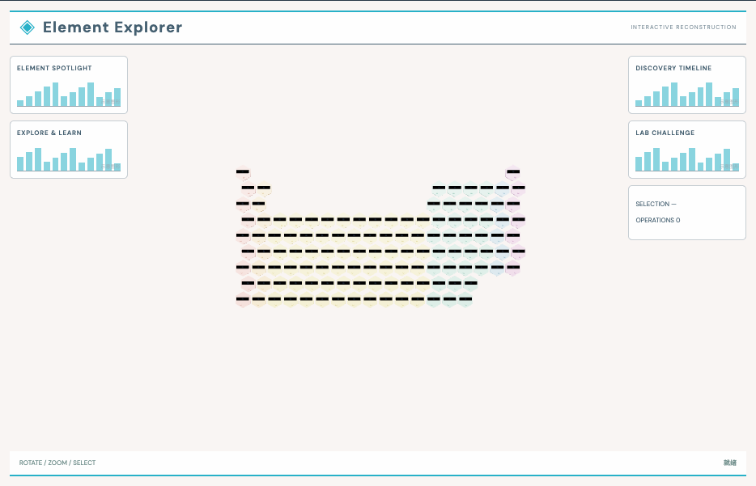

# 原子表示实验：外观复现与运行记录

[打开交互实验](https://weisiwu.github.io/threejs-demo/#/demo/atomic-explorer) · [阅读相关文章](https://imgen.baoganai.com/knowledge/read/dilum-x-atomic-explorer)

## 对照原画面

参考画面：白底科普面板、彩色六角周期表与学习卡。

扩至完整 118 项，选择任一元素后同步名称和控件。

未移植原作发现史、百科和练习题数据。

[逐项对照记录](../research/appearance-review.json) · [外观代码](../src/visuals/)

## 先看机制

原子浏览器区分元素身份和图形表示。原子序数 1–18 决定元素符号与电子计数；按钮在圆轨道壳层与装饰点云间切换。

壳层按 2、8、8 填充。点云使用每个元素对应的固定种子，每个序数生成 150 个点，采样半径采用体积均匀分布 r=R×cbrt(u)。

## 如何核对

点击元素 O，应同步把滑块设为 8；再切表示，元素仍为氧。改变序数会释放上一套几何并构建新实体。

通用控件可以暂停、推进一秒和重置。推进一秒分为二十次 0.05 秒更新，机构约束与任务状态继续经过同一更新流程。浏览器页签隐藏时不积累缺席时间，自动单步长上限为 0.05 秒。自动绘制上限为每秒 30 次；暂停后，参数、选择、镜头或加载完成才触发新画面。

## 源码入口

- [场景实现](../src/scenes/science.ts)：按 slug 分支建立部件、处理输入与输出读数。
- [数学与校验](../src/math.ts)：圆交点、逆运动学、FABRIK、网表求解、A*、指令白名单与图重写。
- [运行时](../src/runtime.ts)：单个渲染器、镜头、暂停、拾取、resize 和资源回收。
- [浏览器检查](../tests/browser/experiments.spec.ts)：桌面与 390px 手机加载、操作、参数、暂停和重置；另有网表失败、库存去重、布局持久化与资源切换用例。

页面读数来自当前场景计算。测试范围见 [验证说明](validation.md)；浏览器检查通过不能代替真实设备、科学精度或外部模型调用验收。

## 原资料与复现范围

装饰点云没有波函数、概率密度或轨道量子数；壳层轨迹也不是量子电子真实路径。让表示方式有明确标签，比给所有形状统一称“电子云”更准确。

壳层与点云均为简化示意，不是电子轨道或量子计算。

原帖文字说明了作者公开展示的方向。后面的仓库用于研究相近机制，除非正文另有说明，不能把它当成该条原帖的完整源码。本轮查看了视频封面并按画面重建。视频播放器未成功加载，完整动作与资产仍未核验。

1. [作者 X 原帖 · 2061490330361589849](https://x.com/DilumSanjaya/status/2061490330361589849)
2. [animated-periodic-table](https://github.com/dilums/animated-periodic-table/tree/4a122495afcd6bbd4b2912f63dfda541ae3f90d8)
