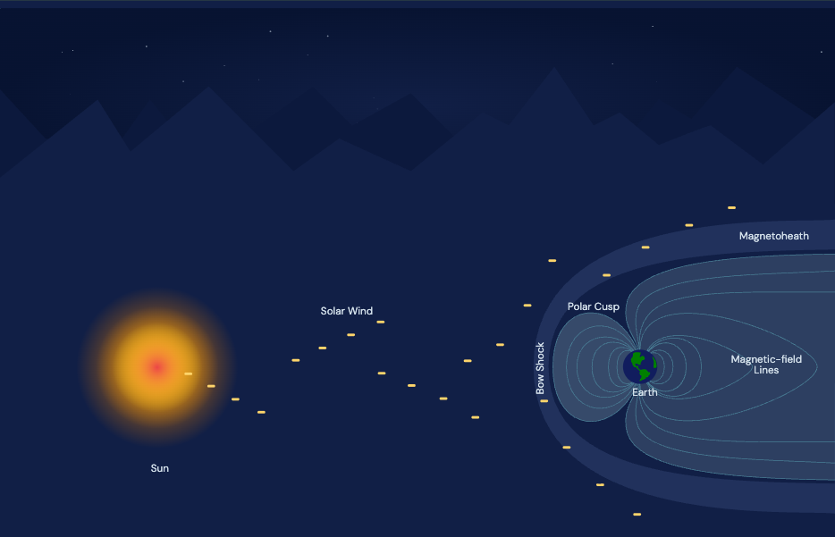

# 极光叙事时间轴：外观复现与运行记录

[打开交互实验](https://weisiwu.github.io/threejs-demo/#/demo/aurora)

## 对照原画面

参考画面：太阳、地球、磁场线与路径粒子的二维图解。

保留 MIT 原工程的 SVG 图形，恢复太阳风与极光的分阶段显示。

时间线采用当前应用的暂停和单步控制，节拍不与原 GSAP 逐帧等同。

[逐项对照记录](../research/appearance-review.json) · [外观代码](../src/visuals/)

## 先看机制

极光演示采用四阶段时间轴：太阳风开始、到达路径、极光显现、循环恢复。时间轴总长八秒，每阶段两秒。

24 个粒子沿八条 CatmullRom 路径运行，幕帘由八条闭合的波状管线构成，在后两阶段可见。下一阶段按钮直接跳到下一个两秒边界；速度只改变时间轴推进。

## 如何核对

连续跳转四次应循环到第一阶段；暂停逐步推进可以检验幕帘出现的边界。

通用控件可以暂停、推进一秒和重置。推进一秒分为二十次 0.05 秒更新，机构约束与任务状态继续经过同一更新流程。浏览器页签隐藏时不积累缺席时间，自动单步长上限为 0.05 秒。自动绘制上限为每秒 30 次；暂停后，参数、选择、镜头或加载完成才触发新画面。

## 源码入口

- [场景实现](../src/scenes/science.ts)：按 slug 分支建立部件、处理输入与输出读数。
- [数学与校验](../src/math.ts)：圆交点、逆运动学、FABRIK、网表求解、A*、指令白名单与图重写。
- [运行时](../src/runtime.ts)：单个渲染器、镜头、暂停、拾取、resize 和资源回收。
- [浏览器检查](../tests/browser/experiments.spec.ts)：桌面与 390px 手机加载、操作、参数、暂停和重置；另有网表失败、库存去重、布局持久化与资源切换用例。

页面读数来自当前场景计算。测试范围见 [验证说明](validation.md)；浏览器检查通过不能代替真实设备、科学精度或外部模型调用验收。

## 原资料与复现范围

路径和幕帘是明确编写的叙事几何，未解洛伦兹力、磁场线或带电粒子分布。时间与比例不对应真实地磁过程。先把事件顺序讲清，再决定是否需要引入物理模型。

粒子沿预设路径，未求解洛伦兹力或真实磁场。

来源包括文章或固定提交源码。复现保留可讨论的机制，界面与几何由本仓库重新实现；原工程依赖、全部资产和部署配置没有直接迁移。

1. [van-allen-belts-auroras](https://github.com/dilums/van-allen-belts-auroras/tree/94fcad576ddf633c79a06d52a03cc0c4ddf50638)
