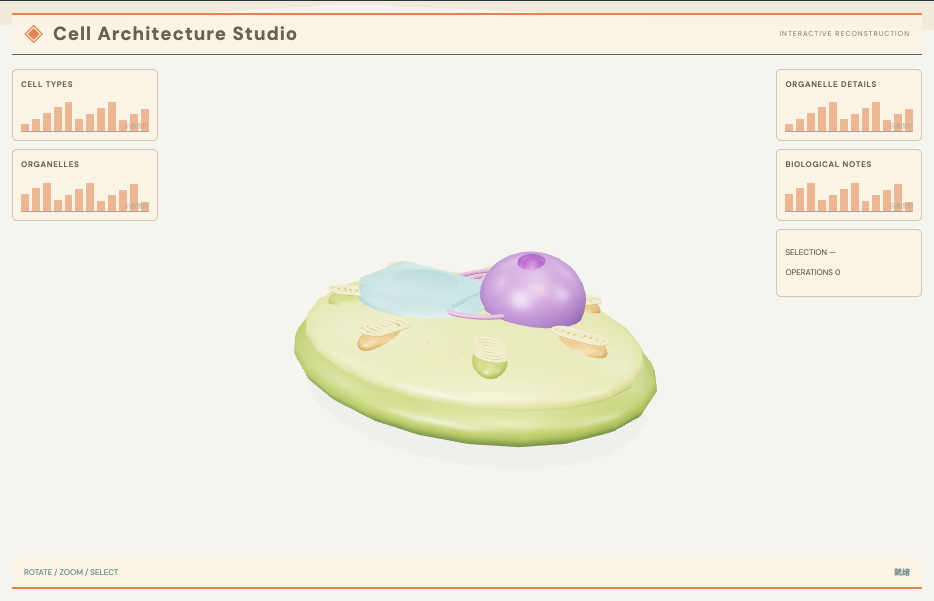

# 生物形态浏览器：外观复现与运行记录

[打开交互实验](https://weisiwu.github.io/threejs-demo/#/demo/biological-structure) · [阅读相关文章](https://imgen.baoganai.com/knowledge/read/dilum-x-biological-structures)

## 对照原画面

参考画面：米色植物细胞工作台，绿色截面、蓝色液泡和紫色细胞核。

补齐细胞壁、液泡、细胞核、内质网和带纹路的细胞器。

原作细胞形状和微观表面更复杂；当前没有原始生物模型。

[逐项对照记录](../research/appearance-review.json) · [外观代码](../src/visuals/)

## 先看机制

结构探索用四个部件表达外膜、核区与两个细胞器。每个部件有 ID 与初始坐标，拆解通过初始坐标加偏移×进度计算，拖回零能精确回位。

透明外膜关闭 depthWrite，减少对内部物体的遮挡；外膜显隐、选中 ID 和拆解进度是三份状态。列表与拾取都能定位同一部件。

## 如何核对

选择核区，拖到完全拆解再归零；隐藏外膜不改变内部部件身份或坐标。

通用控件可以暂停、推进一秒和重置。推进一秒分为二十次 0.05 秒更新，机构约束与任务状态继续经过同一更新流程。浏览器页签隐藏时不积累缺席时间，自动单步长上限为 0.05 秒。

## 源码入口

- [场景实现](../src/scenes/spaces.ts)：按 slug 分支建立部件、处理输入与输出读数。
- [数学与校验](../src/math.ts)：圆交点、逆运动学、FABRIK、网表求解、A*、指令白名单与图重写。
- [运行时](../src/runtime.ts)：单个渲染器、镜头、暂停、拾取、resize 和资源回收。
- [浏览器检查](../tests/browser/experiments.spec.ts)：桌面与 390px 手机加载、操作、参数、暂停和重置；另有网表失败、库存去重、布局持久化与资源切换用例。

页面读数来自当前场景计算。测试范围见 [验证说明](validation.md)；浏览器检查通过不能代替真实设备、科学精度或外部模型调用验收。

## 原资料与复现范围

部件是原创概念形态，没有实验成像、分割标签或真实细胞结构坐标。自动生成模型若要用于科普，应核对术语对应、部件数量、内外关系以及误导性比例。

程序化形态示意，非解剖标准或医疗资料。

原帖文字说明了作者公开展示的方向。后面的仓库用于研究相近机制，除非正文另有说明，不能把它当成该条原帖的完整源码。本轮查看了视频封面并按画面重建。视频播放器未成功加载，完整动作与资产仍未核验。

1. [作者 X 原帖 · 2053155739389378849](https://x.com/DilumSanjaya/status/2053155739389378849)
2. [dna-structure-animation-3d](https://github.com/dilums/dna-structure-animation-3d/tree/6acd2aed1538a48296ae4d3973a2244f2d5579f3)
