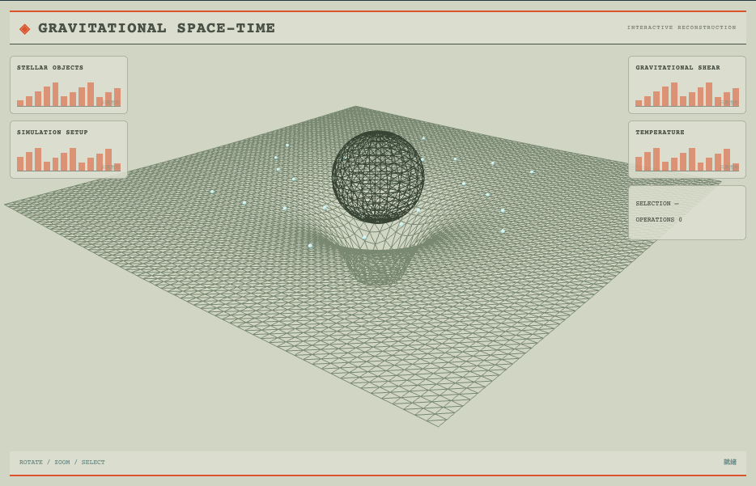

# 时空网格示意：外观复现与运行记录

[打开交互实验](https://weisiwu.github.io/threejs-demo/#/demo/black-hole) · [阅读相关文章](https://imgen.baoganai.com/knowledge/read/dilum-x-black-hole)

## 对照原画面

参考画面：灰绿色工程面板，空间网格凹陷与线框球体。

恢复网格、线框中心球和灰绿配色，保留深度调整。

形变仍是径向展示函数，不能作为广义相对论求解。

[逐项对照记录](../research/appearance-review.json) · [外观代码](../src/visuals/)

## 先看机制

复现将凹陷网格明示为径向展示函数：y=0.3-d/sqrt(max(0.4,r²))。最大值裁剪避开中心除零，d 是展示深度。

网格为 64×64 分段平面，圆环和 24 个绕行点用程序化几何生成。切换按钮改变 wireframe，深度参数只重算网格高度与法线。

## 如何核对

增加深度后检查所有顶点仍为有限数；暂停时绕行点停止，拖镜头仍能观察凹陷形状。

通用控件可以暂停、推进一秒和重置。推进一秒分为二十次 0.05 秒更新，机构约束与任务状态继续经过同一更新流程。浏览器页签隐藏时不积累缺席时间，自动单步长上限为 0.05 秒。

## 源码入口

- [场景实现](../src/scenes/science.ts)：按 slug 分支建立部件、处理输入与输出读数。
- [数学与校验](../src/math.ts)：圆交点、逆运动学、FABRIK、网表求解、A*、指令白名单与图重写。
- [运行时](../src/runtime.ts)：单个渲染器、镜头、暂停、拾取、resize 和资源回收。
- [浏览器检查](../tests/browser/experiments.spec.ts)：桌面与 390px 手机加载、操作、参数、暂停和重置；另有网表失败、库存去重、布局持久化与资源切换用例。

页面读数来自当前场景计算。测试范围见 [验证说明](validation.md)；浏览器检查通过不能代替真实设备、科学精度或外部模型调用验收。

## 原资料与复现范围

图形没有解爱因斯坦方程、光线测地线或吸积盘流体。黑色球、亮环、凹陷网格属于三种视觉提示，也没有按物理长度统一标定。若要解释引力透镜，应另外给出光线路径与观测条件。

展示几何，不是广义相对论或粒子动力学求解。

原帖文字说明了作者公开展示的方向。后面的仓库用于研究相近机制，除非正文另有说明，不能把它当成该条原帖的完整源码。本轮查看了视频封面并按画面重建。视频播放器未成功加载，完整动作与资产仍未核验。

1. [作者 X 原帖 · 2052063467407057112](https://x.com/DilumSanjaya/status/2052063467407057112)
2. [animated-solar-system-with-react-three-fiber](https://github.com/dilums/animated-solar-system-with-react-three-fiber/tree/67518d1f5c1fe52ba3cdf5596969fea9bc9912be)
