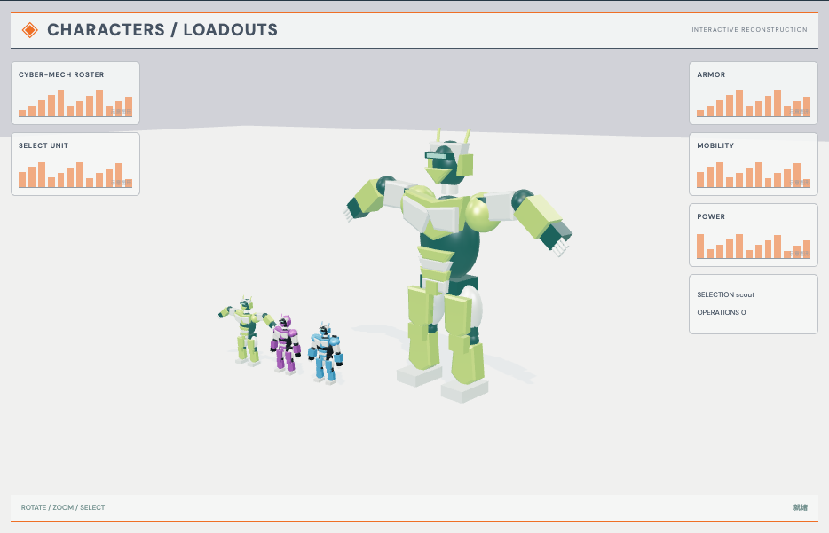

# 角色选择大厅：外观复现与运行记录

[打开交互实验](https://weisiwu.github.io/threejs-demo/#/demo/character-selection) · [阅读相关文章](https://imgen.baoganai.com/knowledge/read/dilum-x-character-selection)

## 对照原画面

参考画面：浅灰选择页，左侧机甲卡，右侧绿黑银色装甲角色。

新增三款独立的角色模型：绿甲侦察角色采用抬臂姿态，紫甲工程角色带头罩和背包，蓝甲守卫角色加宽肩甲。选择不同卡片会切换主模型，确认身份与模型 ID 保持对应。

装甲表面和原角色动画仍为简化处理；这三款是本仓库重建模型，不是 Hunyuan3D 原始网格。

## 新增简版模型

模型由本仓库按参考画面重建，demo 与 GLB 使用同一份源模型工厂。GLB 包含几何、材质；人形模型另附清单列出的肩部待机动画。文件没有外部贴图依赖。轴向为 Y 向上，尺寸为场景单位。

| 模型         | GLB                                                                      | 三角形 | 动画片段 |
| ------------ | ------------------------------------------------------------------------ | -----: | -------: |
| 绿甲侦察角色 | [下载](https://weisiwu.github.io/threejs-demo/models/cyber-scout.glb)    |   5860 |        2 |
| 紫甲工程角色 | [下载](https://weisiwu.github.io/threejs-demo/models/cyber-engineer.glb) |   6452 |        2 |
| 蓝甲守卫角色 | [下载](https://weisiwu.github.io/threejs-demo/models/cyber-guardian.glb) |   6268 |        2 |

[模型源码](../src/models/model-kit.ts) · [部件与型号映射](../src/models/entries.ts) · [原件哈希和部件范围](../public/models/manifest.json) · [MIT 许可](../public/models/LICENSE)

[逐项对照记录](../research/appearance-review.json) · [外观代码](../src/visuals/)

## 先看机制

角色选择包含预览态与确认态。鼠标换预览不能立即覆盖已确认的角色，否则用户尚未提交选择就会进入另一条业务状态。

三款角色分别对应 cyber-scout、cyber-engineer 和 cyber-guardian；业务 ID 仍为 scout、engineer、guardian。选择时切换实际主模型，确认按钮只记录当前业务 ID。小模型与主模型使用同一工厂。

## 如何核对

确认侦察型，再预览工程型，读数中预览 ID 改变、已确认 ID 保持；重置后确认记录回到无。

通用控件可以暂停、推进一秒和重置。推进一秒分为二十次 0.05 秒更新，机构约束与任务状态继续经过同一更新流程。浏览器页签隐藏时不积累缺席时间，自动单步长上限为 0.05 秒。自动绘制上限为每秒 30 次；暂停后，参数、选择、镜头或加载完成才触发新画面。

## 源码入口

- [场景实现](../src/scenes/spaces.ts)：按 slug 分支建立部件、处理输入与输出读数。
- [数学与校验](../src/math.ts)：圆交点、逆运动学、FABRIK、网表求解、A*、指令白名单与图重写。
- [运行时](../src/runtime.ts)：单个渲染器、镜头、暂停、拾取、resize 和资源回收。
- [浏览器检查](../tests/browser/experiments.spec.ts)：桌面与 390px 手机加载、操作、参数、暂停和重置；另有网表失败、库存去重、布局持久化与资源切换用例。

页面读数来自当前场景计算。测试范围见 [验证说明](validation.md)；浏览器检查通过不能代替真实设备、科学精度或外部模型调用验收。

## 原资料与复现范围

角色包含肩肘节点与简版待机动作，GLB 保存两条肩部动画。没有行走或战斗系统；装甲、头罩、背包和不同宽度用于区分三个模型。

本仓库参考画面重建的简版模型；保留选择与状态，未实现原作完整动画或玩法。

原帖文字说明了作者公开展示的方向。后面的仓库用于研究相近机制，除非正文另有说明，不能把它当成该条原帖的完整源码。本轮查看了视频封面并按画面重建。视频播放器未成功加载，完整动作与资产仍未核验。

1. [作者 X 原帖 · 2008584593222652057](https://x.com/DilumSanjaya/status/2008584593222652057)
2. [aisdk-threejs-starter](https://github.com/dilums/aisdk-threejs-starter/tree/8b182dc5314fc622e61f262fc6bc0301bc31e2c3)
