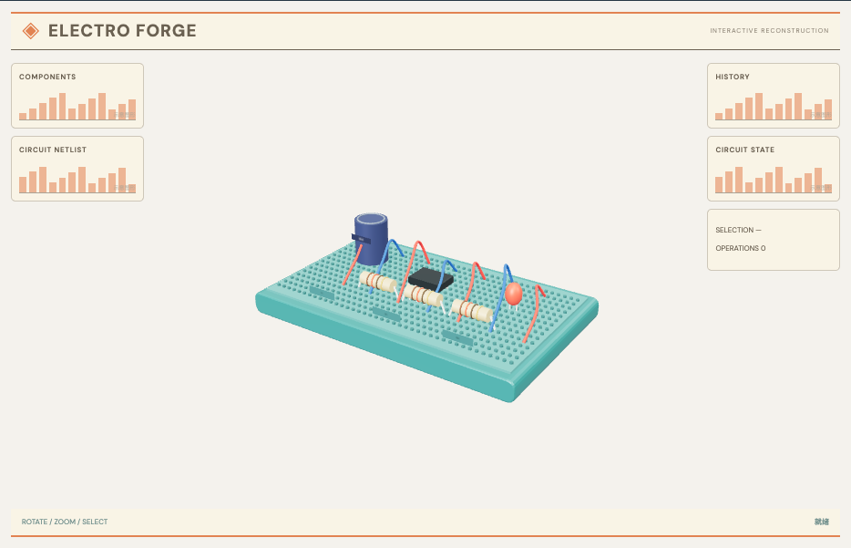

# 电路网表工作台：外观复现与运行记录

[打开交互实验](https://weisiwu.github.io/threejs-demo/#/demo/circuit-builder) · [阅读相关文章](https://imgen.baoganai.com/knowledge/read/dilum-x-local-circuit-json)

## 对照原画面

参考画面：米色工作台上的青绿面包板、红蓝跳线和有色电子元件。

补齐板孔、跳线、电阻色环、电容、芯片外形与 LED。

外观件不是完整求解电路；MNA 只求解正文列出的线性网表，未模拟 555 振荡器。

[逐项对照记录](../research/appearance-review.json) · [外观代码](../src/visuals/)

## 先看机制

电路展示先求解网表，再画图。支持电阻和独立理想电压源，以节点 0 为参考，采用修正节点分析 MNA，联立节点电压和电压源电流。

电阻在矩阵中写入导纳 1/R 的对角与负的非对角项；电压源增加一行一列约束。高斯消元使用部分主元，主元小于 10⁻¹² 时报告奇异。默认 12V 与两只 1kΩ 电阻的 out 为 6V。

## 如何核对

先求默认分压，再改一只电阻；把引脚写成不存在的节点，旧电压应保留且回执说明原因。

通用控件可以暂停、推进一秒和重置。推进一秒分为二十次 0.05 秒更新，机构约束与任务状态继续经过同一更新流程。浏览器页签隐藏时不积累缺席时间，自动单步长上限为 0.05 秒。

## 源码入口

- [场景实现](../src/scenes/interfaces.tsx)：按 slug 分支建立部件、处理输入与输出读数。
- [数学与校验](../src/math.ts)：圆交点、逆运动学、FABRIK、网表求解、A*、指令白名单与图重写。
- [运行时](../src/runtime.ts)：单个渲染器、镜头、暂停、拾取、resize 和资源回收。
- [浏览器检查](../tests/browser/experiments.spec.ts)：桌面与 390px 手机加载、操作、参数、暂停和重置；另有网表失败、库存去重、布局持久化与资源切换用例。

页面读数来自当前场景计算。测试范围见 [验证说明](validation.md)；浏览器检查通过不能代替真实设备、科学精度或外部模型调用验收。

## 原资料与复现范围

修改 R2 为 2kΩ 后 out 为 8V。无效网表不会替换上一成功解。最多 30 节点与 60 器件；没有交流、瞬态、二极管或 SPICE 兼容承诺，也没有把模型文本当可执行电路代码。

本地网表求解；未调用 Gemma 或其他模型，暂不支持交流与非线性器件。

原帖文字说明了作者公开展示的方向。后面的仓库用于研究相近机制，除非正文另有说明，不能把它当成该条原帖的完整源码。本轮查看了视频封面并按画面重建。视频播放器未成功加载，完整动作与资产仍未核验。

1. [作者 X 原帖 · 2070187709361254669](https://x.com/DilumSanjaya/status/2070187709361254669)
2. [aisdk-threejs-starter](https://github.com/dilums/aisdk-threejs-starter/tree/8b182dc5314fc622e61f262fc6bc0301bc31e2c3)
