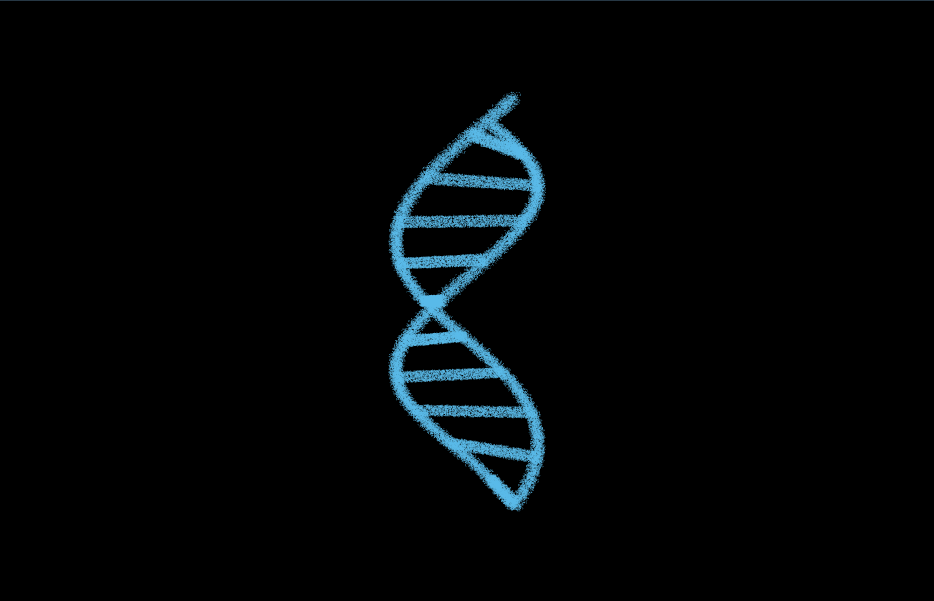

# DNA 点云：外观复现与运行记录

[打开交互实验](https://weisiwu.github.io/threejs-demo/#/demo/dna-structure)

## 对照原画面

参考画面：黑底蓝色点云双螺旋，匀速转动。

按原源码的一圈螺旋、120°相位和间隔横桥重建点云。

采样使用固定种子；密度控制范围与原作常量不同。

[逐项对照记录](../research/appearance-review.json) · [外观代码](../src/visuals/)

## 先看机制

双螺旋展示由两条参数曲线和连接杆组成。曲线绕三圈，半径 1.3，高度 7，两股相位相差 120°；这个角度是视觉配置，不能拿来解释真实碱基对几何。

点云使用固定种子，密度参数乘以 4000 得到点数，其中每五个点插入一个横向连接采样。骨架由两条 TubeGeometry 与十九根连接杆构成。切换表示只改变显隐，改密度才重建数据。

## 如何核对

比较点云与骨架，修改密度并查看几何资源数量；重置回到同一种子和默认密度。

通用控件可以暂停、推进一秒和重置。推进一秒分为二十次 0.05 秒更新，机构约束与任务状态继续经过同一更新流程。浏览器页签隐藏时不积累缺席时间，自动单步长上限为 0.05 秒。自动绘制上限为每秒 30 次；暂停后，参数、选择、镜头或加载完成才触发新画面。

## 源码入口

- [场景实现](../src/scenes/science.ts)：按 slug 分支建立部件、处理输入与输出读数。
- [数学与校验](../src/math.ts)：圆交点、逆运动学、FABRIK、网表求解、A*、指令白名单与图重写。
- [运行时](../src/runtime.ts)：单个渲染器、镜头、暂停、拾取、resize 和资源回收。
- [浏览器检查](../tests/browser/experiments.spec.ts)：桌面与 390px 手机加载、操作、参数、暂停和重置；另有网表失败、库存去重、布局持久化与资源切换用例。

页面读数来自当前场景计算。测试范围见 [验证说明](validation.md)；浏览器检查通过不能代替真实设备、科学精度或外部模型调用验收。

## 原资料与复现范围

原资料可以用来研究粒子预算与曲线生成，但本例没有碱基序列、原子坐标、化学键级和真实沟槽尺寸。点数增加反映显示成本，不能作为科学精度增加的证据。

双螺旋造型示意，没有真实原子、碱基或实验结构映射。

来源包括文章或固定提交源码。复现保留可讨论的机制，界面与几何由本仓库重新实现；原工程依赖、全部资产和部署配置没有直接迁移。

1. [dna-structure-animation-3d](https://github.com/dilums/dna-structure-animation-3d/tree/6acd2aed1538a48296ae4d3973a2244f2d5579f3)
