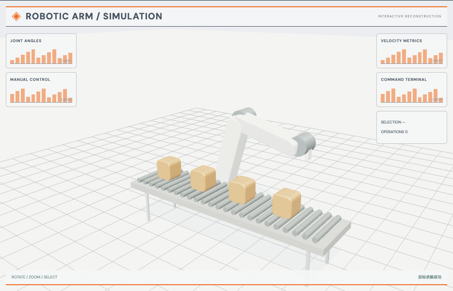

# 机械臂 IK 工作站：外观复现与运行记录

[打开交互实验](https://weisiwu.github.io/threejs-demo/#/demo/industrial-arm) · [阅读相关文章](https://imgen.baoganai.com/knowledge/read/dilum-x-industrial-arm)

## 对照原画面

参考画面：灰白工位、橙色关节机械臂、传送带与纸箱。

恢复白色臂壳、关节、夹爪和辊道工位，并保留实际 IK 更新。

尚未完成原作抓取、释放、传送带任务的整套动作序列。

[逐项对照记录](../research/appearance-review.json) · [外观代码](../src/visuals/)

## 先看机制

本例求解位置，不求完整六自由度姿态。基座朝向把三维目标转换到一个垂直平面，肩肘采用两段 IK，腕部只作可见的末端结构。

两段长度为 3 和 2.6，水平目标距离为 3.5，高度由滑块提供。余弦定理先算肘角，再求肩角；拒绝超过总臂长或落在内侧盲区的目标。按钮转动目标方位，机械臂重新求解。

## 如何核对

提高目标到不可达区，回执应说明失败；降回可达高度再看误差恢复。

通用控件可以暂停、推进一秒和重置。推进一秒分为二十次 0.05 秒更新，机构约束与任务状态继续经过同一更新流程。浏览器页签隐藏时不积累缺席时间，自动单步长上限为 0.05 秒。自动绘制上限为每秒 30 次；暂停后，参数、选择、镜头或加载完成才触发新画面。

## 源码入口

- [场景实现](../src/scenes/mechanics.ts)：按 slug 分支建立部件、处理输入与输出读数。
- [数学与校验](../src/math.ts)：圆交点、逆运动学、FABRIK、网表求解、A*、指令白名单与图重写。
- [运行时](../src/runtime.ts)：单个渲染器、镜头、暂停、拾取、resize 和资源回收。
- [浏览器检查](../tests/browser/experiments.spec.ts)：桌面与 390px 手机加载、操作、参数、暂停和重置；另有网表失败、库存去重、布局持久化与资源切换用例。

页面读数来自当前场景计算。测试范围见 [验证说明](validation.md)；浏览器检查通过不能代替真实设备、科学精度或外部模型调用验收。

## 原资料与复现范围

读数包括端点误差和关节角。不可达目标保留上一姿态，失败不是把目标强制夹回可达边界。没有关节限位、末端方向、碰撞避让或真机命令，因此不能将这个演示称为完整机器人控制器。

实现位置 IK 与腕部显示，不是全六自由度求解或真机控制。

原帖文字说明了作者公开展示的方向。后面的仓库用于研究相近机制，除非正文另有说明，不能把它当成该条原帖的完整源码。本轮查看了视频封面并按画面重建。视频播放器未成功加载，完整动作与资产仍未核验。

1. [作者 X 原帖 · 2027426781389897883](https://x.com/DilumSanjaya/status/2027426781389897883)
2. [hexapod-robot-simulator](https://github.com/dilums/hexapod-robot-simulator/tree/f0e5dc24369a3c77d596eac5762e674403687373)
