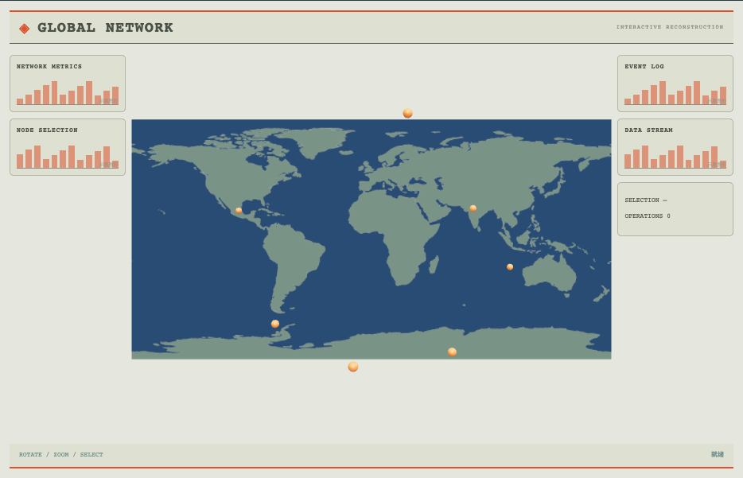

# 交互地图实验：外观复现与运行记录

[打开交互实验](https://weisiwu.github.io/threejs-demo/#/demo/interactive-map) · [阅读相关文章](https://imgen.baoganai.com/knowledge/read/dilum-x-map-interactions)

## 对照原画面

参考画面：浅色世界地图、路径连线和监测卡。

引入真实大陆轮廓，恢复地图平面与事件标记。

事件点位和路由仍为合成样本，原作的详细行政边界未补齐。

[逐项对照记录](../research/appearance-review.json) · [外观代码](../src/visuals/)

## 先看机制

地图的选择与筛选应保留节点 ID。复现有十六个节点、两类颜色及固定连接，UI 列表与三维拾取共享 node-N。

筛选轮换全部、青色、金色，地图缩放统一作用于场景组。隐藏节点仍保留其数据身份，筛选不重建或重新编号；选择读数明确保留最后选中的 ID。

## 如何核对

选择 node-1，再筛选青色，确认可见数量降为 8；原 ID 保留但对象暂不可见，不应把它错误改成 node-0。

通用控件可以暂停、推进一秒和重置。推进一秒分为二十次 0.05 秒更新，机构约束与任务状态继续经过同一更新流程。浏览器页签隐藏时不积累缺席时间，自动单步长上限为 0.05 秒。自动绘制上限为每秒 30 次；暂停后，参数、选择、镜头或加载完成才触发新画面。

## 源码入口

- [场景实现](../src/scenes/interfaces.tsx)：按 slug 分支建立部件、处理输入与输出读数。
- [数学与校验](../src/math.ts)：圆交点、逆运动学、FABRIK、网表求解、A*、指令白名单与图重写。
- [运行时](../src/runtime.ts)：单个渲染器、镜头、暂停、拾取、resize 和资源回收。
- [浏览器检查](../tests/browser/experiments.spec.ts)：桌面与 390px 手机加载、操作、参数、暂停和重置；另有网表失败、库存去重、布局持久化与资源切换用例。

页面读数来自当前场景计算。测试范围见 [验证说明](validation.md)；浏览器检查通过不能代替真实设备、科学精度或外部模型调用验收。

## 原资料与复现范围

节点与连接是合成拓扑，没有地理坐标、能源站点或地理投影。空间布局只帮助检查操作关联。用于实际地图时，应先分清地理尺度、屏幕缩放、相机距离以及过滤后的连接显示规则。

地图为自定义示意坐标，不提供地理定位精度。

原帖文字说明了作者公开展示的方向。后面的仓库用于研究相近机制，除非正文另有说明，不能把它当成该条原帖的完整源码。本轮查看了视频封面并按画面重建。视频播放器未成功加载，完整动作与资产仍未核验。

1. [作者 X 原帖 · 2043734181314998677](https://x.com/DilumSanjaya/status/2043734181314998677)
2. [customizable-react-dashboard-with-charts](https://github.com/dilums/customizable-react-dashboard-with-charts/tree/eac83918b76fe38b931a76a3e9882399663fbc0a)
