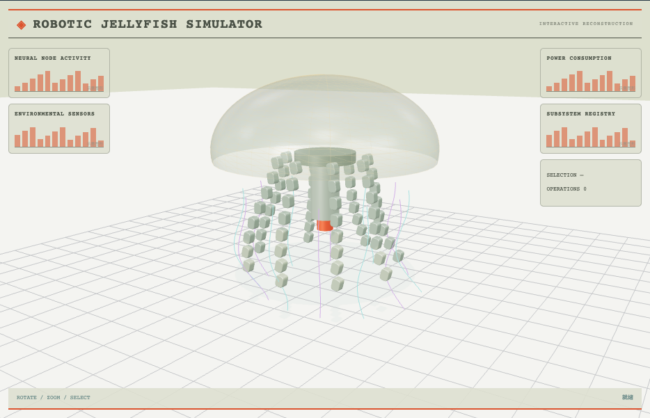

# 水母机器人原型：外观复现与运行记录

[打开交互实验](https://weisiwu.github.io/threejs-demo/#/demo/jellyfish-robot) · [阅读相关文章](https://imgen.baoganai.com/knowledge/read/dilum-x-jellyfish-robot)

## 对照原画面

参考画面：灰绿工程面板，透明伞面、内部执行器和柔软触须。

恢复透明网格伞面、中央驱动、八组执行器与摆动触须。

执行器连接和游动动力学仍未复刻，只保留周期性形变。

[逐项对照记录](../research/appearance-review.json) · [外观代码](../src/visuals/)

## 先看机制

水母外形可拆成伞面与触须。伞面是部分球面，12 条触须分别维护 24 个顶点，随相位更新。

径向尺度为 1+A sinφ，垂直尺度为 1/sqrt(径向尺度)，使简单缩放的体积因子约保持 1。幅度上限 0.8 让径向尺度保持正值。晶格按钮展示球面的 WireframeGeometry。

## 如何核对

提高幅度观察整个周期，尺度应始终为正；打开晶格后，晶格与伞面使用同一缩放。

通用控件可以暂停、推进一秒和重置。推进一秒分为二十次 0.05 秒更新，机构约束与任务状态继续经过同一更新流程。浏览器页签隐藏时不积累缺席时间，自动单步长上限为 0.05 秒。

## 源码入口

- [场景实现](../src/scenes/mechanics.ts)：按 slug 分支建立部件、处理输入与输出读数。
- [数学与校验](../src/math.ts)：圆交点、逆运动学、FABRIK、网表求解、A*、指令白名单与图重写。
- [运行时](../src/runtime.ts)：单个渲染器、镜头、暂停、拾取、resize 和资源回收。
- [浏览器检查](../tests/browser/experiments.spec.ts)：桌面与 390px 手机加载、操作、参数、暂停和重置；另有网表失败、库存去重、布局持久化与资源切换用例。

页面读数来自当前场景计算。测试范围见 [验证说明](validation.md)；浏览器检查通过不能代替真实设备、科学精度或外部模型调用验收。

## 原资料与复现范围

体积缩放关系不是材料本构模型。触须是指定曲线，没有液体阻力、浮力、驱动器或真实晶格结构。显示线框只便于看几何，不说明微结构已生成或制造。

外壳为展示晶格，没有纳米尺度、耐压或水动力证据。

原帖文字说明了作者公开展示的方向。后面的仓库用于研究相近机制，除非正文另有说明，不能把它当成该条原帖的完整源码。本轮查看了视频封面并按画面重建。视频播放器未成功加载，完整动作与资产仍未核验。

1. [作者 X 原帖 · 2091568845463101550](https://x.com/DilumSanjaya/status/2091568845463101550)
2. [kinematic-creatures](https://github.com/dilums/kinematic-creatures/tree/5cb2408262dd271b1f9ae1746c32161ee54e07dc)
