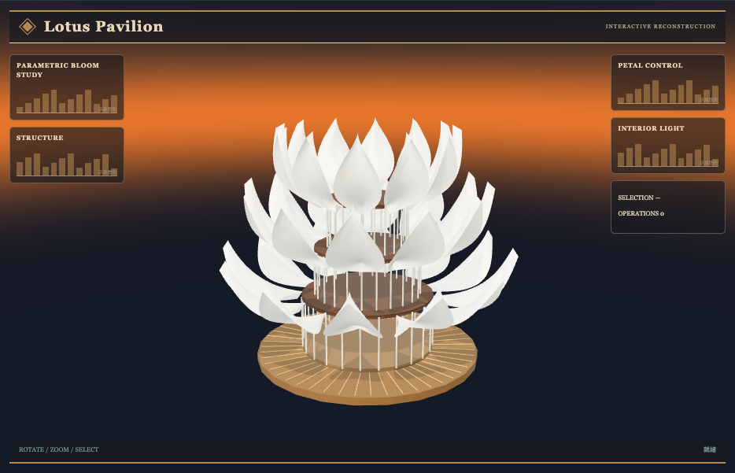

# 动态花瓣亭：外观复现与运行记录

[打开交互实验](https://weisiwu.github.io/threejs-demo/#/demo/kinetic-pavilion) · [阅读相关文章](https://imgen.baoganai.com/knowledge/read/dilum-x-kinetic-pavilion)

## 对照原画面

参考画面：黄昏中的木质玻璃建筑，三层白色莲花瓣。

重建木质圆台、玻璃围护和分层曲面花瓣，默认显示展开态。

原作分层独立控制和内部家具尚未补齐；曲面为参考重建。

[逐项对照记录](../research/appearance-review.json) · [外观代码](../src/visuals/)

## 先看机制

开合建筑可先用层级 transform 做原型。六根立柱与六片花瓣各有铰链 group，花瓣局部几何随铰链旋转，中心与支点不随开合漂移。

滑块直接设置开合比例，按钮发出目标 0 或 1。每帧按 dt×2.5 向目标插值，误差小于阈值时精确落到终点；手动拖动会取消自动目标，避免两种输入互相争抢。

## 如何核对

自动展开途中手动拖动，自动目标应取消；恢复按钮开合后最终读数达到 0 或 1。

通用控件可以暂停、推进一秒和重置。推进一秒分为二十次 0.05 秒更新，机构约束与任务状态继续经过同一更新流程。浏览器页签隐藏时不积累缺席时间，自动单步长上限为 0.05 秒。自动绘制上限为每秒 30 次；暂停后，参数、选择、镜头或加载完成才触发新画面。

## 源码入口

- [场景实现](../src/scenes/mechanics.ts)：按 slug 分支建立部件、处理输入与输出读数。
- [数学与校验](../src/math.ts)：圆交点、逆运动学、FABRIK、网表求解、A*、指令白名单与图重写。
- [运行时](../src/runtime.ts)：单个渲染器、镜头、暂停、拾取、resize 和资源回收。
- [浏览器检查](../tests/browser/experiments.spec.ts)：桌面与 390px 手机加载、操作、参数、暂停和重置；另有网表失败、库存去重、布局持久化与资源切换用例。

页面读数来自当前场景计算。测试范围见 [验证说明](validation.md)；浏览器检查通过不能代替真实设备、科学精度或外部模型调用验收。

## 原资料与复现范围

形态由程序化半球片构成，未模拟受力、遮阳性能或建筑机械尺寸。开合视觉可以验证控制与层级关系，结构可建造性仍需实体设计资料。

建筑运动学原型，未做结构、碰撞或可施工验证。

原帖文字说明了作者公开展示的方向。后面的仓库用于研究相近机制，除非正文另有说明，不能把它当成该条原帖的完整源码。本轮查看了视频封面并按画面重建。视频播放器未成功加载，完整动作与资产仍未核验。

1. [作者 X 原帖 · 2081060174954188957](https://x.com/DilumSanjaya/status/2081060174954188957)
2. [responsive-strandbeest](https://github.com/dilums/responsive-strandbeest/tree/4eb0e454bb4d089de4c40da21f51c4efacad4e24)
