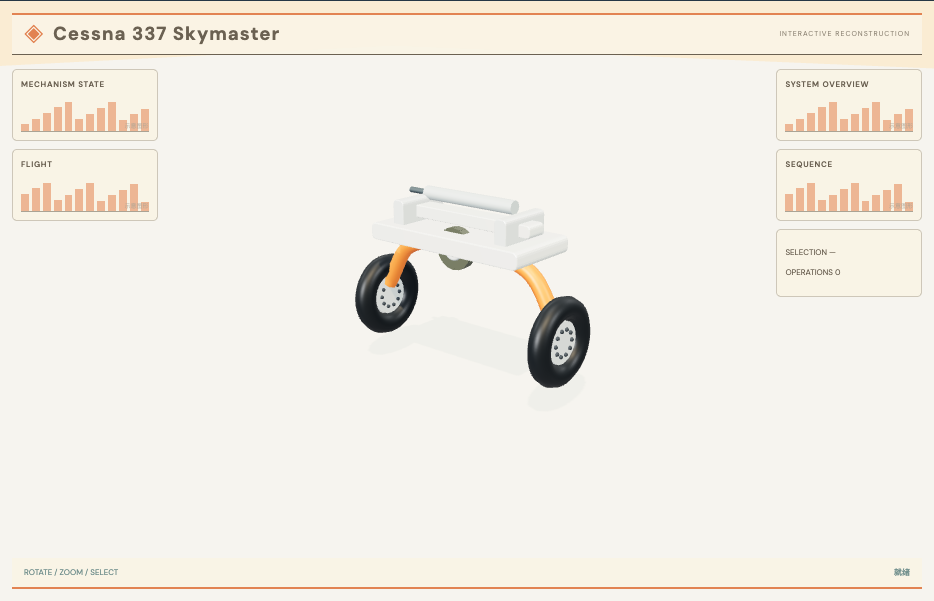

# 起落架收放机构：外观复现与运行记录

[打开交互实验](https://weisiwu.github.io/threejs-demo/#/demo/landing-gear) · [阅读相关文章](https://imgen.baoganai.com/knowledge/read/dilum-x-landing-gear)

## 对照原画面

参考画面：米色航空页面，橙色双弯腿、两主轮和白色中央安装架。

撤去单柱双轮，重建双侧弯腿、主轮、中央支架与油缸外形。

单执行器、齿轮箱与万向轴的完整传动仍未核验，收放动画保留简化铰链。

[逐项对照记录](../research/appearance-review.json) · [外观代码](../src/visuals/)

## 先看机制

起落架使用铰链层级表达收放：安装座固定，支柱、轮轴与两只轮子随同一个 hinge 旋转。收放进度映射到 0–1.4 弧度。

按钮在展开与收起间设置目标，平滑插值到终点；手动拖动取消自动目标。侧撑杆连接固定点和支柱端点，其长度随动作变化，明确当作伸缩作动杆显示。

## 如何核对

收起到一半后手动拖回展开，检查轮组保持整体；操作到终点后读数精确为 0 或 1。

通用控件可以暂停、推进一秒和重置。推进一秒分为二十次 0.05 秒更新，机构约束与任务状态继续经过同一更新流程。浏览器页签隐藏时不积累缺席时间，自动单步长上限为 0.05 秒。

## 源码入口

- [场景实现](../src/scenes/mechanics.ts)：按 slug 分支建立部件、处理输入与输出读数。
- [数学与校验](../src/math.ts)：圆交点、逆运动学、FABRIK、网表求解、A*、指令白名单与图重写。
- [运行时](../src/runtime.ts)：单个渲染器、镜头、暂停、拾取、resize 和资源回收。
- [浏览器检查](../tests/browser/experiments.spec.ts)：桌面与 390px 手机加载、操作、参数、暂停和重置；另有网表失败、库存去重、布局持久化与资源切换用例。

页面读数来自当前场景计算。测试范围见 [验证说明](validation.md)；浏览器检查通过不能代替真实设备、科学精度或外部模型调用验收。

## 原资料与复现范围

没有闭环锁止、载荷或液压求解，也没有采用某型飞机的实测几何。若把可伸缩杆称为定长连杆，就会对机构自由度产生错误解释；本例保留这个简化范围。

参考题材的原创机构，不是 Cessna 337 精确工程复刻。

原帖文字说明了作者公开展示的方向。后面的仓库用于研究相近机制，除非正文另有说明，不能把它当成该条原帖的完整源码。本轮查看了视频封面并按画面重建。视频播放器未成功加载，完整动作与资产仍未核验。

1. [作者 X 原帖 · 2096642895134752922](https://x.com/DilumSanjaya/status/2096642895134752922)
2. [responsive-strandbeest](https://github.com/dilums/responsive-strandbeest/tree/4eb0e454bb4d089de4c40da21f51c4efacad4e24)
