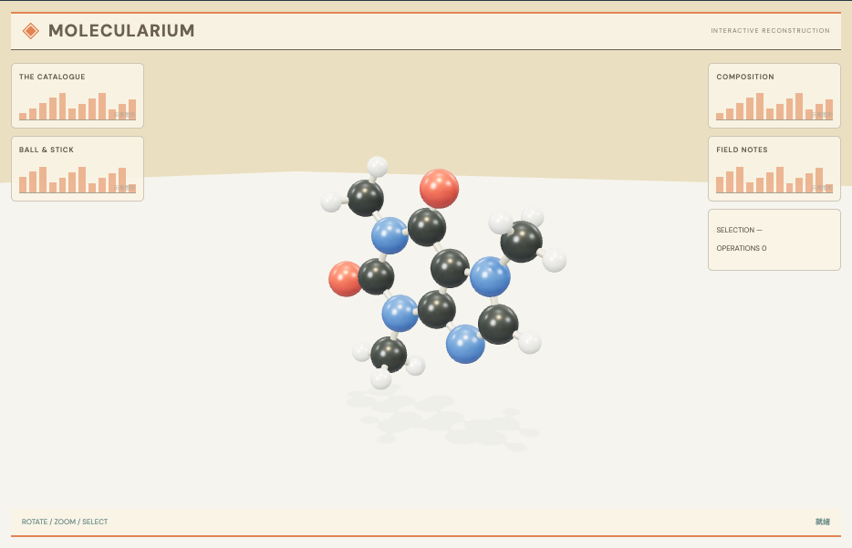

# 分子图与空间结构：外观复现与运行记录

[打开交互实验](https://weisiwu.github.io/threejs-demo/#/demo/molecular-structure) · [阅读相关文章](https://imgen.baoganai.com/knowledge/read/dilum-x-molecular-graph)

## 对照原画面

参考画面：米色分子图鉴，咖啡因的黑、红、蓝、白球棍模型。

默认模型改用 PubChem CID 2519 的 24 个三维原子，保留切换和尺度控制。

原作分子目录更多；水、乙醇和苯仍为教学坐标，显示未表达全部键级。

[逐项对照记录](../research/appearance-review.json) · [外观代码](../src/visuals/)

## 先看机制

默认咖啡因使用 PubChem CID 2519 的 24 个原子与三维坐标，键端点按 aid 建立对应。另有水、乙醇和苯三个教学示例。

键记录引用原子数组，换分子先释放旧网格，再按新表建立原子与连接。显示键长滑块在同一中心缩放坐标，连接端点随原子位置重算。

## 如何核对

先核对默认咖啡因的 24 个原子，再切换到水：读数应变为 3 个原子，上一分子的选择清空。

通用控件可以暂停、推进一秒和重置。推进一秒分为二十次 0.05 秒更新，机构约束与任务状态继续经过同一更新流程。浏览器页签隐藏时不积累缺席时间，自动单步长上限为 0.05 秒。

## 源码入口

- [场景实现](../src/scenes/science.ts)：按 slug 分支建立部件、处理输入与输出读数。
- [数学与校验](../src/math.ts)：圆交点、逆运动学、FABRIK、网表求解、A*、指令白名单与图重写。
- [运行时](../src/runtime.ts)：单个渲染器、镜头、暂停、拾取、resize 和资源回收。
- [浏览器检查](../tests/browser/experiments.spec.ts)：桌面与 390px 手机加载、操作、参数、暂停和重置；另有网表失败、库存去重、布局持久化与资源切换用例。

页面读数来自当前场景计算。测试范围见 [验证说明](validation.md)；浏览器检查通过不能代替真实设备、科学精度或外部模型调用验收。

## 原资料与复现范围

咖啡因坐标来自 PubChem 的 3D conformer，其他三个例子仍为教学摆放。统一显示未表达全部键级；尺度滑块会改变显示键长，不能用它测量分子的实验尺寸。

小分子连接示例；坐标为教学摆放，未做能量优化。

原帖文字说明了作者公开展示的方向。后面的仓库用于研究相近机制，除非正文另有说明，不能把它当成该条原帖的完整源码。本轮查看了视频封面并按画面重建。视频播放器未成功加载，完整动作与资产仍未核验。

1. [作者 X 原帖 · 2063664615398240467](https://x.com/DilumSanjaya/status/2063664615398240467)
2. [dna-structure-animation-3d](https://github.com/dilums/dna-structure-animation-3d/tree/6acd2aed1538a48296ae4d3973a2244f2d5579f3)
