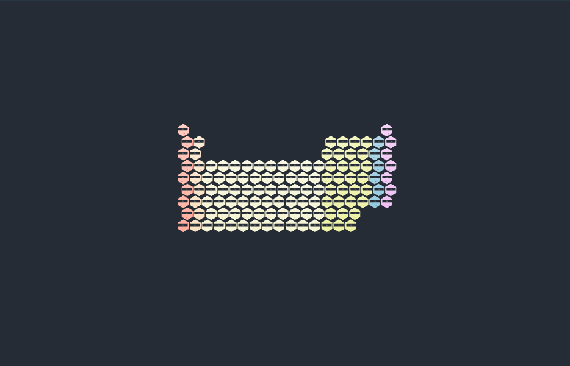

# 元素相态卡片：外观复现与运行记录

[打开交互实验](https://weisiwu.github.io/threejs-demo/#/demo/periodic-table)

## 对照原画面

参考画面：深灰背景上的完整六角元素表，格内有相态动画。

恢复 118 项的六角排布、分类颜色和动态粒点。

液面波动与气体格的原始 SVG 动画尚未逐项移植。

[逐项对照记录](../research/appearance-review.json) · [外观代码](../src/visuals/)

## 先看机制

恢复完整的 118 项六角周期表，元素 ID 与选中状态分别保存。原子壳层读数只是教学表示，格内动画参考原作的相态图形。

界面支持选择所有元素。隐藏的教学壳层按容量分配简化电子，六角格上的动画点用于表示视觉变化，没有依据温压计算相态。

## 如何核对

选择氧后核对符号与原子序数，再选择第 118 项 Og；控件应保持 118，重置后恢复默认选择。

通用控件可以暂停、推进一秒和重置。推进一秒分为二十次 0.05 秒更新，机构约束与任务状态继续经过同一更新流程。浏览器页签隐藏时不积累缺席时间，自动单步长上限为 0.05 秒。自动绘制上限为每秒 30 次；暂停后，参数、选择、镜头或加载完成才触发新画面。

## 源码入口

- [场景实现](../src/scenes/science.ts)：按 slug 分支建立部件、处理输入与输出读数。
- [数学与校验](../src/math.ts)：圆交点、逆运动学、FABRIK、网表求解、A*、指令白名单与图重写。
- [运行时](../src/runtime.ts)：单个渲染器、镜头、暂停、拾取、resize 和资源回收。
- [浏览器检查](../tests/browser/experiments.spec.ts)：桌面与 390px 手机加载、操作、参数、暂停和重置；另有网表失败、库存去重、布局持久化与资源切换用例。

页面读数来自当前场景计算。测试范围见 [验证说明](validation.md)；浏览器检查通过不能代替真实设备、科学精度或外部模型调用验收。

## 原资料与复现范围

元素身份与表示方式分开：切相态不改变选中元素。真实元素百科还需要物性数据、单位与来源，特别是沸点、密度与晶型。当前画面不能证明电子沿这些圆轨道运动。

相态切换为图形实验，不是温度压强下的相变计算。

来源包括文章或固定提交源码。复现保留可讨论的机制，界面与几何由本仓库重新实现；原工程依赖、全部资产和部署配置没有直接迁移。

1. [animated-periodic-table](https://github.com/dilums/animated-periodic-table/tree/4a122495afcd6bbd4b2912f63dfda541ae3f90d8)
