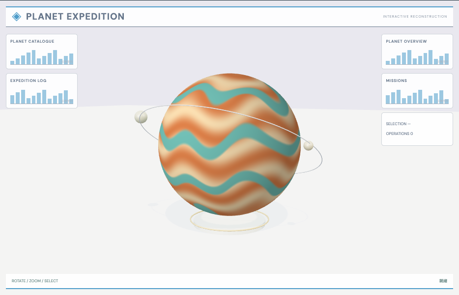

# 行星探索台：外观复现与运行记录

[打开交互实验](https://weisiwu.github.io/threejs-demo/#/demo/planet-explorer) · [阅读相关文章](https://imgen.baoganai.com/knowledge/read/dilum-x-planet-explorer)

## 对照原画面

参考画面：浅色探险界面，青橙条带星球、卫星与底部展示台。

使用程序着色器恢复大气条带，补齐卫星轨道和展示台。

纹理为本仓库生成，多颗星球暂时共用同一几何和着色器。

[逐项对照记录](../research/appearance-review.json) · [外观代码](../src/visuals/)

## 先看机制

行星浏览器把选中对象和镜头目标关联。列表选择与场景拾取都使用 planet-N，选中后根据对象世界坐标设置 OrbitControls target，并移动镜头到相对偏移。

六个行星沿指定椭圆运动，按钮切换 1 与 1.25 的显示尺度。倍率控制模拟相位，选中行为只改变当前镜头快照；没有持续追踪行星的摄像机系统。

## 如何核对

点击行星 A，镜头目标改变；暂停后切换尺度再选 B，确认目标使用更新后的世界位置。

通用控件可以暂停、推进一秒和重置。推进一秒分为二十次 0.05 秒更新，机构约束与任务状态继续经过同一更新流程。浏览器页签隐藏时不积累缺席时间，自动单步长上限为 0.05 秒。

## 源码入口

- [场景实现](../src/scenes/science.ts)：按 slug 分支建立部件、处理输入与输出读数。
- [数学与校验](../src/math.ts)：圆交点、逆运动学、FABRIK、网表求解、A*、指令白名单与图重写。
- [运行时](../src/runtime.ts)：单个渲染器、镜头、暂停、拾取、resize 和资源回收。
- [浏览器检查](../tests/browser/experiments.spec.ts)：桌面与 390px 手机加载、操作、参数、暂停和重置；另有网表失败、库存去重、布局持久化与资源切换用例。

页面读数来自当前场景计算。测试范围见 [验证说明](validation.md)；浏览器检查通过不能代替真实设备、科学精度或外部模型调用验收。

## 原资料与复现范围

球体没有真实地表纹理与星历，名称 A–F 也是示例标签。浏览器机制可用于检查生成星球资产的展示流程，但天体参数需要另接数据源。

虚构行星展示配置；没有真实天体力学与图像生成记录。

原帖文字说明了作者公开展示的方向。后面的仓库用于研究相近机制，除非正文另有说明，不能把它当成该条原帖的完整源码。本轮查看了视频封面并按画面重建。视频播放器未成功加载，完整动作与资产仍未核验。

1. [作者 X 原帖 · 2050981225175928895](https://x.com/DilumSanjaya/status/2050981225175928895)
2. [animated-solar-system-with-react-three-fiber](https://github.com/dilums/animated-solar-system-with-react-three-fiber/tree/67518d1f5c1fe52ba3cdf5596969fea9bc9912be)
