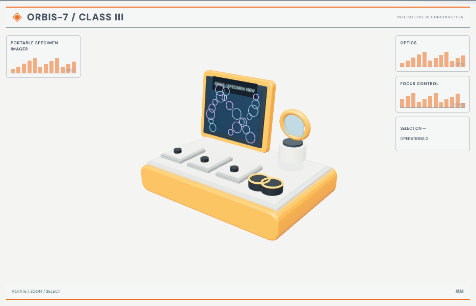

# 便携显微镜机构：外观复现与运行记录

[打开交互实验](https://weisiwu.github.io/threejs-demo/#/demo/portable-microscope) · [阅读相关文章](https://imgen.baoganai.com/knowledge/read/dilum-x-portable-microscope)

## 对照原画面

参考画面：橙白便携箱，左侧屏幕、右侧镜组和前部控制台。

撤去立式显微镜，补上便携箱、显示器、翻盖光学头与旋钮。

屏幕细胞图为绘制示意，按钮、镜组机构与原件仍未逐个对齐。

[逐项对照记录](../research/appearance-review.json) · [外观代码](../src/visuals/)

## 先看机制

橙色便携箱里，左侧是屏幕，右侧是光学头，底板另有样品槽和旋钮。参数只移动右侧光学头，箱体与样品台保持。

镜筒显示高度按 1.8+0.3×进度计算，属于展示坐标。剖面操作隐藏光学头外罩，露出内部筒体；屏幕保持显示，不把示意画面称为实际采集结果。

## 如何核对

在外罩显示与隐藏两种状态下拖动镜筒位置，确认光学头一起移动，箱体、屏幕与样品台保持。读数随展示高度变化。

通用控件可以暂停、推进一秒和重置。推进一秒分为二十次 0.05 秒更新，机构约束与任务状态继续经过同一更新流程。浏览器页签隐藏时不积累缺席时间，自动单步长上限为 0.05 秒。

## 源码入口

- [场景实现](../src/scenes/mechanics.ts)：按 slug 分支建立部件、处理输入与输出读数。
- [数学与校验](../src/math.ts)：圆交点、逆运动学、FABRIK、网表求解、A*、指令白名单与图重写。
- [运行时](../src/runtime.ts)：单个渲染器、镜头、暂停、拾取、resize 和资源回收。
- [浏览器检查](../tests/browser/experiments.spec.ts)：桌面与 390px 手机加载、操作、参数、暂停和重置；另有网表失败、库存去重、布局持久化与资源切换用例。

页面读数来自当前场景计算。测试范围见 [验证说明](validation.md)；浏览器检查通过不能代替真实设备、科学精度或外部模型调用验收。

## 原资料与复现范围

这是一份程序化结构示意，未核对 CAD 尺寸、打印公差、导向间隙或光学焦距。看上去能滑动不代表实体可装配；原项目若提供 STEP/STL，应另外测包围盒、单位和运动间隙。

显示模型不是可制造 CAD；没有真实光学、标定或 Raspberry Pi 控制。

原帖文字说明了作者公开展示的方向。后面的仓库用于研究相近机制，除非正文另有说明，不能把它当成该条原帖的完整源码。本轮查看了视频封面并按画面重建。视频播放器未成功加载，完整动作与资产仍未核验。

1. [作者 X 原帖 · 2087583466301059567](https://x.com/DilumSanjaya/status/2087583466301059567)
2. [responsive-strandbeest](https://github.com/dilums/responsive-strandbeest/tree/4eb0e454bb4d089de4c40da21f51c4efacad4e24)
