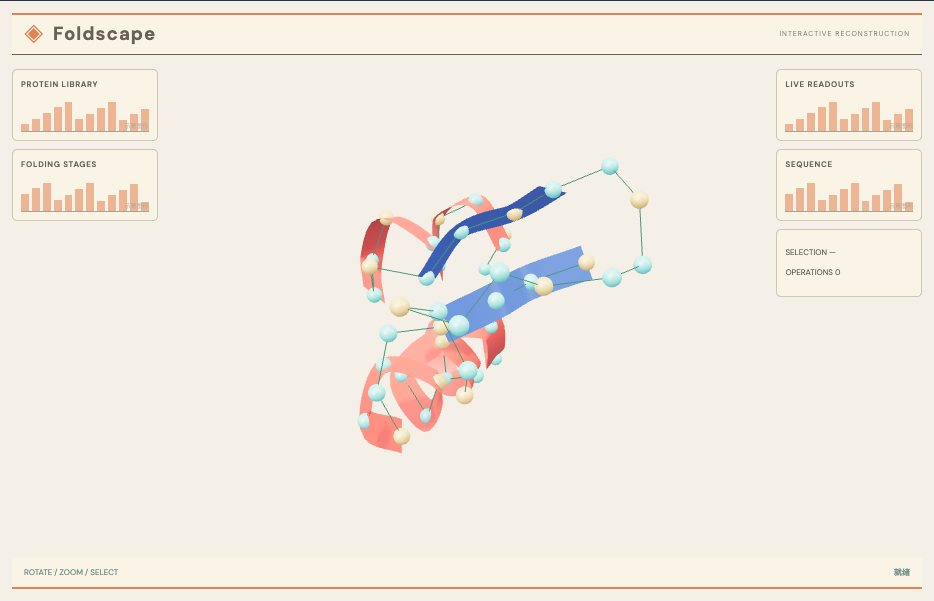

# 蛋白质构象过渡：外观复现与运行记录

[打开交互实验](https://weisiwu.github.io/threejs-demo/#/demo/protein-folding) · [阅读相关文章](https://imgen.baoganai.com/knowledge/read/dilum-x-protein-folding)

## 对照原画面

参考画面：浅色蛋白质工作台，红色螺旋、蓝色折叠片和绿色线圈。

以 1CRN 的真实 Cα 坐标生成带状结构，按 PDB 的 HELIX / SHEET 范围上色。

原片展示另一种大型蛋白；本例只有 46 残基，过渡是坐标插值。

[逐项对照记录](../research/appearance-review.json) · [外观代码](../src/visuals/)

## 先看机制

复现使用 RCSB 的 1CRN PDB 原件，提取链 A 的 46 个 Cα 坐标并保存来源 SHA-256。目标态因此有可查的结构来源，残基 ID 不来自任意造型编号。

将坐标居中后乘 0.15，并将 y 平移到 3；人为构造一条近直线作为起点。过渡按 p(t)=(1-t)p起+t p结构计算，45 条杆连接相邻残基。 画面另外生成红色螺旋带和蓝色折叠片，范围来自原 PDB 的 HELIX 与 SHEET 记录。

## 如何核对

把进度设为 1 查看目标态，点击残基 1、23、46；进度归零是展示起点，不能当作真实展开构象。

通用控件可以暂停、推进一秒和重置。推进一秒分为二十次 0.05 秒更新，机构约束与任务状态继续经过同一更新流程。浏览器页签隐藏时不积累缺席时间，自动单步长上限为 0.05 秒。

## 源码入口

- [场景实现](../src/scenes/science.ts)：按 slug 分支建立部件、处理输入与输出读数。
- [数学与校验](../src/math.ts)：圆交点、逆运动学、FABRIK、网表求解、A*、指令白名单与图重写。
- [运行时](../src/runtime.ts)：单个渲染器、镜头、暂停、拾取、resize 和资源回收。
- [浏览器检查](../tests/browser/experiments.spec.ts)：桌面与 390px 手机加载、操作、参数、暂停和重置；另有网表失败、库存去重、布局持久化与资源切换用例。

结构坐标见 [crambin.json](../src/data/crambin.json)，单位与原始 PDB 哈希保留在数据中。

页面读数来自当前场景计算。测试范围见 [验证说明](validation.md)；浏览器检查通过不能代替真实设备、科学精度或外部模型调用验收。

## 原资料与复现范围

插值期间键距会变化，路径未考虑碰撞、能量或溶剂。这是“形状过渡到实验结构”的展示，不能叫分子动力学或预测折叠。真实坐标终点与人为过渡路径是两种不同证据。

端点来自 1CRN；过渡为人工插值，不是 MD 或真实折叠轨迹。

原帖文字说明了作者公开展示的方向。后面的仓库用于研究相近机制，除非正文另有说明，不能把它当成该条原帖的完整源码。本轮查看了视频封面并按画面重建。视频播放器未成功加载，完整动作与资产仍未核验。

1. [作者 X 原帖 · 2087945482794668167](https://x.com/DilumSanjaya/status/2087945482794668167)
2. [dna-structure-animation-3d](https://github.com/dilums/dna-structure-animation-3d/tree/6acd2aed1538a48296ae4d3973a2244f2d5579f3)
3. [RCSB PDB 1CRN 原始结构](https://www.rcsb.org/structure/1CRN)
