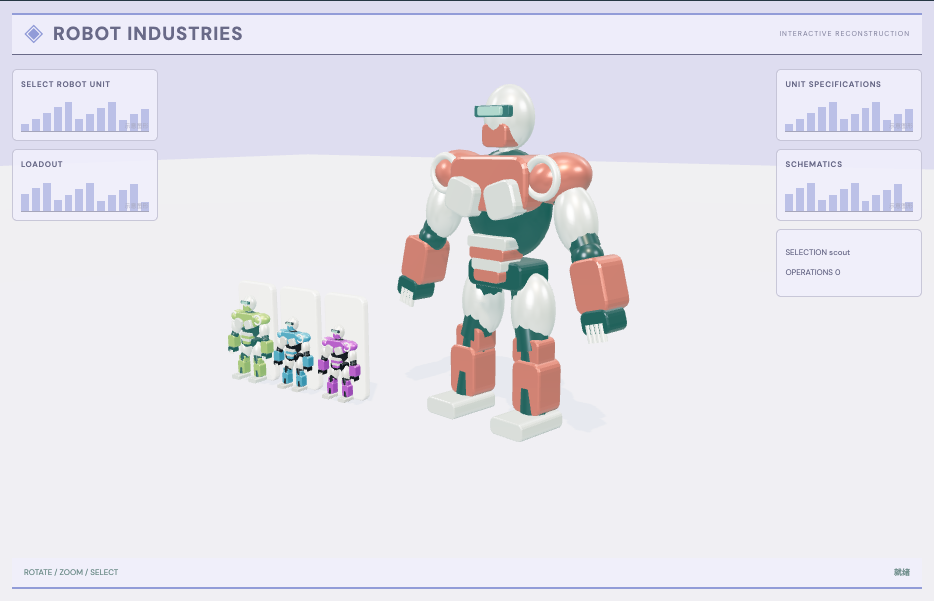

# 机器人图鉴：外观复现与运行记录

[打开交互实验](https://weisiwu.github.io/threejs-demo/#/demo/robot-roster) · [阅读相关文章](https://imgen.baoganai.com/knowledge/read/dilum-x-robot-roster)

## 对照原画面

参考画面：浅紫机库中的红白武装机器人和左侧型号列表。

重建分块金属机甲与型号缩略列，选择后改变主模型装甲颜色。

武器和原始角色模型未取得；现有三个型号共用基础骨架。

[逐项对照记录](../research/appearance-review.json) · [外观代码](../src/visuals/)

## 先看机制

机器人阵列先定义 roster-ID，再定义造型。三个模型共享 humanoid 基础结构，追加程序化肩甲与头环，通过 scout、engineer、guardian 区分身份。

当前预览放大，确认按钮记录选择；粗糙度滑块遍历各模型的 MeshStandardMaterial，改变材质反射而不改身份或网格。三个模型常驻，避免切换期间重新生成 ID。

## 如何核对

先确认工程型，再切守卫型预览，确认态保持；拖粗糙度比较反光，检查模型数量不随操作增加。

通用控件可以暂停、推进一秒和重置。推进一秒分为二十次 0.05 秒更新，机构约束与任务状态继续经过同一更新流程。浏览器页签隐藏时不积累缺席时间，自动单步长上限为 0.05 秒。自动绘制上限为每秒 30 次；暂停后，参数、选择、镜头或加载完成才触发新画面。

## 源码入口

- [场景实现](../src/scenes/spaces.ts)：按 slug 分支建立部件、处理输入与输出读数。
- [数学与校验](../src/math.ts)：圆交点、逆运动学、FABRIK、网表求解、A*、指令白名单与图重写。
- [运行时](../src/runtime.ts)：单个渲染器、镜头、暂停、拾取、resize 和资源回收。
- [浏览器检查](../tests/browser/experiments.spec.ts)：桌面与 390px 手机加载、操作、参数、暂停和重置；另有网表失败、库存去重、布局持久化与资源切换用例。

页面读数来自当前场景计算。测试范围见 [验证说明](validation.md)；浏览器检查通过不能代替真实设备、科学精度或外部模型调用验收。

## 原资料与复现范围

未导入任何生成机器人资产，也没有骨骼、关节驱动和性能设定。材质更亮不代表模型质量更高；真正筛选生成资产还需比较面数、拓扑、贴图和动画兼容性。

程序化原创造型，不含原帖角色媒体或生成模型。

原帖文字说明了作者公开展示的方向。后面的仓库用于研究相近机制，除非正文另有说明，不能把它当成该条原帖的完整源码。本轮查看了视频封面并按画面重建。视频播放器未成功加载，完整动作与资产仍未核验。

1. [作者 X 原帖 · 2049169897029042176](https://x.com/DilumSanjaya/status/2049169897029042176)
2. [aisdk-threejs-starter](https://github.com/dilums/aisdk-threejs-starter/tree/8b182dc5314fc622e61f262fc6bc0301bc31e2c3)
