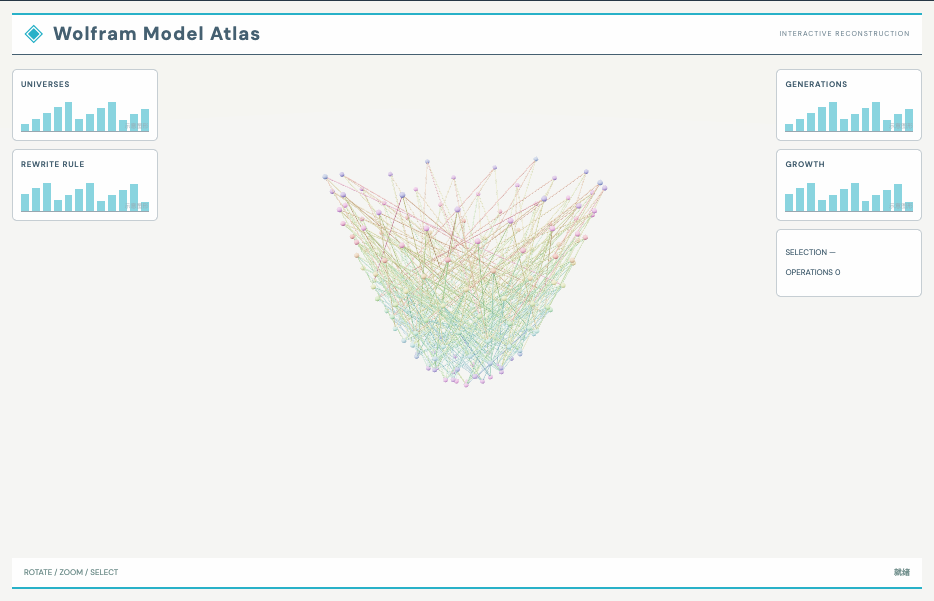

# 规则图演化：外观复现与运行记录

[打开交互实验](https://weisiwu.github.io/threejs-demo/#/demo/rule-universe) · [阅读相关文章](https://imgen.baoganai.com/knowledge/read/dilum-x-rule-universes)

## 对照原画面

参考画面：白色研究界面，密集的紫红色三维超图。

默认先执行 158 次真实重写，形成 160 节点的图，再允许继续增长。

当前是自定义有向多重图规则，与原帖选中的 Wolfram Universe 7862 不同。

[逐项对照记录](../research/appearance-review.json) · [外观代码](../src/visuals/)

## 先看机制

图重写需要明确匹配与替换。程序先从节点 0、1 与边 0→1 出发，执行 158 次同一规则，得到默认显示的 160 个节点。

旧边替换为 a→c、c→b、c→((a+b)%c)，边记录每步增加 2，节点 ID 单调增加。位置使用固定黄金角螺旋，与重写语义分开；trace 记录主路径替换，第三条支边由规则定义。

## 如何核对

默认读数为 160 个节点，重写一次变为 161；重置恢复 160。预算只限制后续增长，不会凭空生成新节点。

通用控件可以暂停、推进一秒和重置。推进一秒分为二十次 0.05 秒更新，机构约束与任务状态继续经过同一更新流程。浏览器页签隐藏时不积累缺席时间，自动单步长上限为 0.05 秒。自动绘制上限为每秒 30 次；暂停后，参数、选择、镜头或加载完成才触发新画面。

## 源码入口

- [场景实现](../src/scenes/science.ts)：按 slug 分支建立部件、处理输入与输出读数。
- [数学与校验](../src/math.ts)：圆交点、逆运动学、FABRIK、网表求解、A*、指令白名单与图重写。
- [运行时](../src/runtime.ts)：单个渲染器、镜头、暂停、拾取、resize 和资源回收。
- [浏览器检查](../tests/browser/experiments.spec.ts)：桌面与 390px 手机加载、操作、参数、暂停和重置；另有网表失败、库存去重、布局持久化与资源切换用例。

页面读数来自当前场景计算。测试范围见 [验证说明](validation.md)；浏览器检查通过不能代替真实设备、科学精度或外部模型调用验收。

## 原资料与复现范围

预算控制 nextId 的上限，达到预算后保留上一张完整图。它是确定性的有向多重图教学规则，没有物理宇宙、Wolfram 模型求证或因果不变性结论；重复边允许存在。

图重写实验，未复现某个 Notable Universe 或作物理预测。

原帖文字说明了作者公开展示的方向。后面的仓库用于研究相近机制，除非正文另有说明，不能把它当成该条原帖的完整源码。本轮查看了视频封面并按画面重建。视频播放器未成功加载，完整动作与资产仍未核验。

1. [作者 X 原帖 · 2086133240273031290](https://x.com/DilumSanjaya/status/2086133240273031290)
2. [aisdk-threejs-starter](https://github.com/dilums/aisdk-threejs-starter/tree/8b182dc5314fc622e61f262fc6bc0301bc31e2c3)
