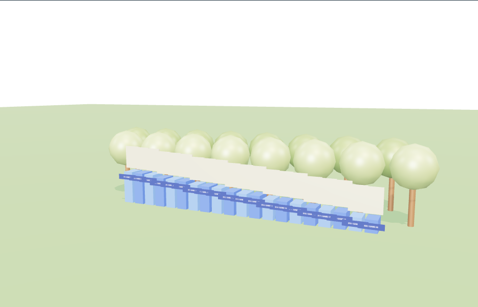

# 销量数据时间轴：外观复现与运行记录

[打开交互实验](https://weisiwu.github.io/threejs-demo/#/demo/sales-timeline) · [阅读相关文章](https://imgen.baoganai.com/knowledge/read/dilum-x-remotion-sales)

## 对照原画面

参考画面：白底低多边形树林，蓝色销量柱和游戏封面牌。

恢复树林、蓝柱和柱顶展示牌，排序仍按当前数据计算。

封面用文字牌替代；数值为合成数据，未复刻原片的任天堂销量动画。

[逐项对照记录](../research/appearance-review.json) · [外观代码](../src/visuals/)

## 先看机制

排名动画必须从时间点算出结果。复现使用二十条带稳定 game-ID 的合成记录，时间点 t 决定数值，随后按值排序，并列时按 ID 排序。

展示帧编号为 floor(30t)，柱高为值/14。两套样例共享 ID，样例 B 加入不同偏移。每次渲染直接计算当前快照，不依赖上一帧递增排名，所以向前向后拖时间有明确结果。

## 如何核对

记下同一时间点的第一名与数值，来回拖动后回到原位置，应得到相同结果。

通用控件可以暂停、推进一秒和重置。推进一秒分为二十次 0.05 秒更新，机构约束与任务状态继续经过同一更新流程。浏览器页签隐藏时不积累缺席时间，自动单步长上限为 0.05 秒。

## 源码入口

- [场景实现](../src/scenes/science.ts)：按 slug 分支建立部件、处理输入与输出读数。
- [数学与校验](../src/math.ts)：圆交点、逆运动学、FABRIK、网表求解、A*、指令白名单与图重写。
- [运行时](../src/runtime.ts)：单个渲染器、镜头、暂停、拾取、resize 和资源回收。
- [浏览器检查](../tests/browser/experiments.spec.ts)：桌面与 390px 手机加载、操作、参数、暂停和重置；另有网表失败、库存去重、布局持久化与资源切换用例。

页面读数来自当前场景计算。测试范围见 [验证说明](validation.md)；浏览器检查通过不能代替真实设备、科学精度或外部模型调用验收。

## 原资料与复现范围

没有真实销量表，也没有调用 Remotion 导出。三维柱体复现的是数据时间轴交互；若要声称某年的销量榜，必须补充地域、统计口径、截止时间和原表。

使用合成销量数据，未复现真实榜单或运行 Remotion 导出。

原帖文字说明了作者公开展示的方向。后面的仓库用于研究相近机制，除非正文另有说明，不能把它当成该条原帖的完整源码。本轮查看了视频封面并按画面重建。视频播放器未成功加载，完整动作与资产仍未核验。

1. [作者 X 原帖 · 2018367621381620142](https://x.com/DilumSanjaya/status/2018367621381620142)
2. [animated-solar-system-with-react-three-fiber](https://github.com/dilums/animated-solar-system-with-react-three-fiber/tree/67518d1f5c1fe52ba3cdf5596969fea9bc9912be)
3. [Remotion 官方基础文档](https://www.remotion.dev/docs/the-fundamentals)
