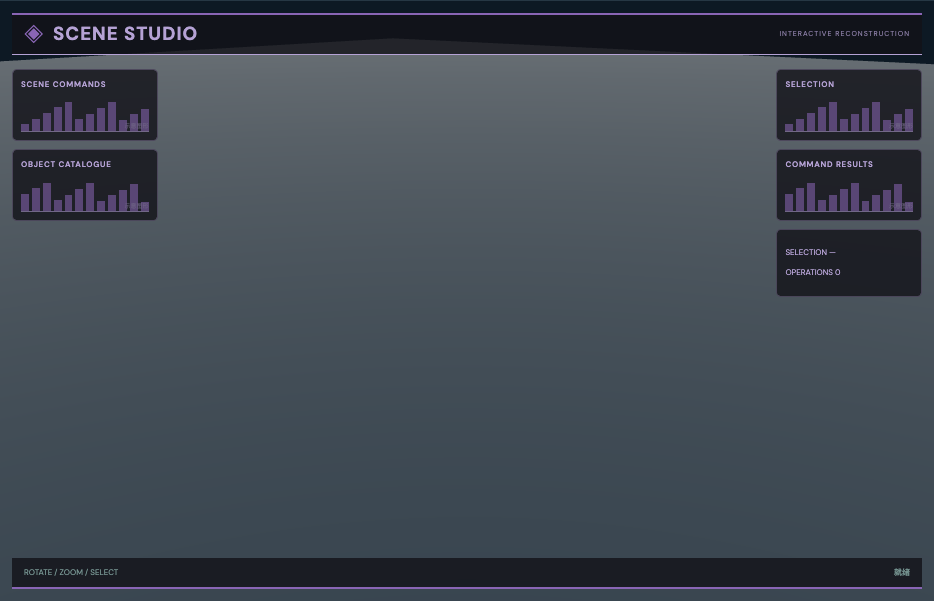

# 场景指令工作台：外观复现与运行记录

[打开交互实验](https://weisiwu.github.io/threejs-demo/#/demo/scene-builder) · [阅读相关文章](https://imgen.baoganai.com/knowledge/read/dilum-ai-scene-protocol)

## 对照原画面

参考画面：对话侧栏驱动的三维场景。

保留深色编辑空间与可执行的场景命令。

指令仍由用户编辑；未接入原作模型服务和流式工具调用。

[逐项对照记录](../research/appearance-review.json) · [外观代码](../src/visuals/)

## 先看机制

模型产出落到场景时，最容易出问题的是执行边界。复现只接受 add、remove、clear 的 JSON 指令，不解释 JavaScript，也不执行模型返回的函数。

sceneCommand 在一次提交里校验所有对象，再返回新数组。类型限定 box、sphere、cylinder；位置需三个有限数，绝对值不超过 20，尺寸在 0.05–5，颜色为六位十六进制。总物体不超过 40，业务 ID 唯一。

## 如何核对

添加一个物体，再提交未知类型，数量仍应为 1；最后准备并执行 clear，数量归零。将 remove 的 ID 写错也会整条拒绝。

通用控件可以暂停、推进一秒和重置。推进一秒分为二十次 0.05 秒更新，机构约束与任务状态继续经过同一更新流程。浏览器页签隐藏时不积累缺席时间，自动单步长上限为 0.05 秒。

## 源码入口

- [场景实现](../src/scenes/interfaces.tsx)：按 slug 分支建立部件、处理输入与输出读数。
- [数学与校验](../src/math.ts)：圆交点、逆运动学、FABRIK、网表求解、A*、指令白名单与图重写。
- [运行时](../src/runtime.ts)：单个渲染器、镜头、暂停、拾取、resize 和资源回收。
- [浏览器检查](../tests/browser/experiments.spec.ts)：桌面与 390px 手机加载、操作、参数、暂停和重置；另有网表失败、库存去重、布局持久化与资源切换用例。

页面读数来自当前场景计算。测试范围见 [验证说明](validation.md)；浏览器检查通过不能代替真实设备、科学精度或外部模型调用验收。

## 原资料与复现范围

校验失败会保留原场景，错误信息进入回执。默认尺寸参数修改待提交的 add 指令；真正生效的几何由指令决定。更新场景先释放旧资源，避免反复编辑积累几何。原作者起步仓库可供接口研究，但本例没有接入 AI SDK 或任何收费模型。

使用本地结构化指令；未调用语言模型或生成服务。

来源包括文章或固定提交源码。复现保留可讨论的机制，界面与几何由本仓库重新实现；原工程依赖、全部资产和部署配置没有直接迁移。

1. [aisdk-threejs-starter](https://github.com/dilums/aisdk-threejs-starter/tree/8b182dc5314fc622e61f262fc6bc0301bc31e2c3)
