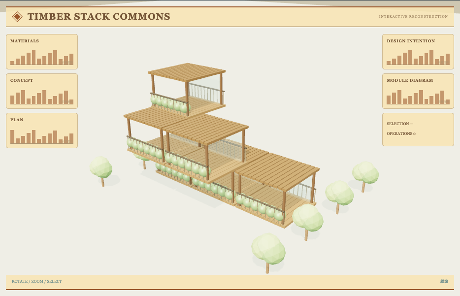

# 二维到三维示意：外观复现与运行记录

[打开交互实验](https://weisiwu.github.io/threejs-demo/#/demo/schematic-transition) · [阅读相关文章](https://imgen.baoganai.com/knowledge/read/dilum-x-schematic-to-3d)

## 对照原画面

参考画面：米色图纸中的木框模块建筑、露台栏杆和绿化。

重建叠层木框、玻璃、屋面、栏杆与植物，转换到俯视线框。

原作完整设计、标注和构件数量未取得。

[逐项对照记录](../research/appearance-review.json) · [外观代码](../src/visuals/)

## 先看机制

二维到三维转换应保持部件与连接身份。本例有六个 part-N 与五条固定连接，二维和三维只是一组不同坐标。

每个部件位置按两套坐标线性插值，连线端点每帧从部件位置读取，避免各自启动动画后出现脱节。按钮设置目标视图，滑块输入取消自动转换。

## 如何核对

选中一个部件，转换到三维再返回二维；part-ID 与连接数量不变，所有杆端点跟随同一组坐标。

通用控件可以暂停、推进一秒和重置。推进一秒分为二十次 0.05 秒更新，机构约束与任务状态继续经过同一更新流程。浏览器页签隐藏时不积累缺席时间，自动单步长上限为 0.05 秒。

## 源码入口

- [场景实现](../src/scenes/spaces.ts)：按 slug 分支建立部件、处理输入与输出读数。
- [数学与校验](../src/math.ts)：圆交点、逆运动学、FABRIK、网表求解、A*、指令白名单与图重写。
- [运行时](../src/runtime.ts)：单个渲染器、镜头、暂停、拾取、resize 和资源回收。
- [浏览器检查](../tests/browser/experiments.spec.ts)：桌面与 390px 手机加载、操作、参数、暂停和重置；另有网表失败、库存去重、布局持久化与资源切换用例。

页面读数来自当前场景计算。测试范围见 [验证说明](validation.md)；浏览器检查通过不能代替真实设备、科学精度或外部模型调用验收。

## 原资料与复现范围

这没有转换 CAD 几何，也未从图片识别电路。用途是检查一个结构在不同呈现方式下能否仍被选中、关联和回位；拓扑与相机维度应分开讨论。

表示切换，不是从图片自动恢复真实尺寸或拓扑。

原帖文字说明了作者公开展示的方向。后面的仓库用于研究相近机制，除非正文另有说明，不能把它当成该条原帖的完整源码。本轮查看了视频封面并按画面重建。视频播放器未成功加载，完整动作与资产仍未核验。

1. [作者 X 原帖 · 2097005668389802027](https://x.com/DilumSanjaya/status/2097005668389802027)
2. [aisdk-threejs-starter](https://github.com/dilums/aisdk-threejs-starter/tree/8b182dc5314fc622e61f262fc6bc0301bc31e2c3)
