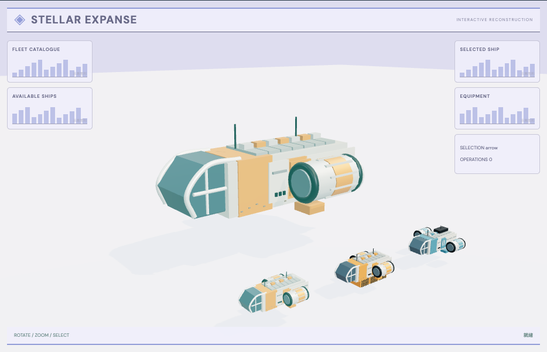

# 飞船整备舱：外观复现与运行记录

[打开交互实验](https://weisiwu.github.io/threejs-demo/#/demo/ship-selection) · [阅读相关文章](https://imgen.baoganai.com/knowledge/read/dilum-x-ship-selection)

## 对照原画面

参考画面：浅紫色机库，橙白货运艇、侧置发动机和底部缩略图。

新增标准货运艇、重载货运艇和双翼探索艇。默认货运艇补齐座舱窗框、橙白箱式船体、面板分缝、底部挂件和两侧发动机；重载型增加货箱，探索型增加翼面。切换艇型会显示对应模型，发动机装备开关分别保留。

磨损用少量几何色块表达，原作贴图、完整船型库与飞行动画仍未取得；当前三款是本仓库简版重建。

## 新增简版模型

模型由本仓库按参考画面重建，demo 与 GLB 使用同一份源模型工厂。GLB 包含几何、材质；人形模型另附清单列出的肩部待机动画。文件没有外部贴图依赖。轴向为 Y 向上，尺寸为场景单位。

| 模型       | GLB                                                                      | 三角形 | 动画片段 |
| ---------- | ------------------------------------------------------------------------ | -----: | -------: |
| 标准货运艇 | [下载](https://weisiwu.github.io/threejs-demo/models/ship-hauler.glb)    |   5184 |        0 |
| 重载货运艇 | [下载](https://weisiwu.github.io/threejs-demo/models/ship-freighter.glb) |   5580 |        0 |
| 双翼探索艇 | [下载](https://weisiwu.github.io/threejs-demo/models/ship-explorer.glb)  |   5236 |        0 |

[模型源码](../src/models/model-kit.ts) · [部件与型号映射](../src/models/entries.ts) · [原件哈希和部件范围](../public/models/manifest.json) · [MIT 许可](../public/models/LICENSE)

[逐项对照记录](../research/appearance-review.json) · [外观代码](../src/visuals/)

## 先看机制

选船与装备是两份状态：selection 决定当前操作目标，每艘船自己的 Map 项记录推进器是否装备。换船不应把上一艘的装备复制过来。

三款独立模型分别展示标准货运、重载货运和双翼探索结构，业务 ID 保持 arrow、freighter、drifter。发动机节点名为 engine-left 和 engine-right，装备记录按 shipId 保存，切换艇型后各自状态保持。

## 如何核对

在标准货运艇卸下发动机，切换重载货运艇再切回来；标准艇仍为卸下，重载艇保持原状态。

通用控件可以暂停、推进一秒和重置。推进一秒分为二十次 0.05 秒更新，机构约束与任务状态继续经过同一更新流程。浏览器页签隐藏时不积累缺席时间，自动单步长上限为 0.05 秒。自动绘制上限为每秒 30 次；暂停后，参数、选择、镜头或加载完成才触发新画面。

## 源码入口

- [场景实现](../src/scenes/spaces.ts)：按 slug 分支建立部件、处理输入与输出读数。
- [数学与校验](../src/math.ts)：圆交点、逆运动学、FABRIK、网表求解、A*、指令白名单与图重写。
- [运行时](../src/runtime.ts)：单个渲染器、镜头、暂停、拾取、resize 和资源回收。
- [浏览器检查](../tests/browser/experiments.spec.ts)：桌面与 390px 手机加载、操作、参数、暂停和重置；另有网表失败、库存去重、布局持久化与资源切换用例。

页面读数来自当前场景计算。测试范围见 [验证说明](validation.md)；浏览器检查通过不能代替真实设备、科学精度或外部模型调用验收。

## 原资料与复现范围

座舱框、面板、货箱、翼面和发动机都进入 GLB 原件，文件没有外部贴图。轴向采用 Y 向上，尺寸为场景单位；这些简版没有可飞行控制器、推力计算或碰撞飞行验收。

本仓库参考画面重建的简版模型；保留选择与状态，未实现原作完整动画或玩法。

原帖文字说明了作者公开展示的方向。后面的仓库用于研究相近机制，除非正文另有说明，不能把它当成该条原帖的完整源码。本轮查看了视频封面并按画面重建。视频播放器未成功加载，完整动作与资产仍未核验。

1. [作者 X 原帖 · 2016193959408836932](https://x.com/DilumSanjaya/status/2016193959408836932)
2. [aisdk-threejs-starter](https://github.com/dilums/aisdk-threejs-starter/tree/8b182dc5314fc622e61f262fc6bc0301bc31e2c3)
