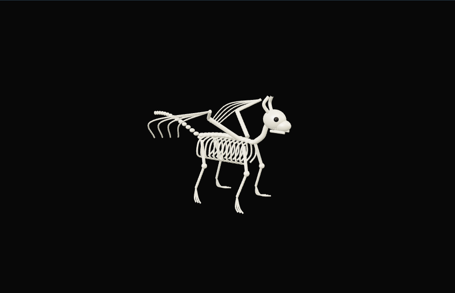

# 骨骼结构浏览器：外观复现与运行记录

[打开交互实验](https://weisiwu.github.io/threejs-demo/#/demo/skeleton-explorer) · [阅读相关文章](https://imgen.baoganai.com/knowledge/read/dilum-x-trellis-skeleton)

## 对照原画面

参考画面：黑底、带翼和长尾的兽类骨架。

重建脊柱、肋骨、翼指、尾椎、头骨和四肢，恢复骨白材质。

这是按封面构型重建的骨架，没有取得 TRELLIS 输出网格；骨形细节有明显差距。

[逐项对照记录](../research/appearance-review.json) · [外观代码](../src/visuals/)

## 先看机制

结构查看器首先处理部件身份。本例有头部、八个椎体、六根肋环与四根长骨，共十九个程序化部件；每个部件都有稳定 ID。

列表按钮与场景拾取都写入 selection。拆解参数只移动各部件的 transform，不重新分配 ID；隔离按钮显示当前部件，再次操作恢复整体。高亮与运行读数读取同一选择。

## 如何核对

从列表选 skull，再拖拆解间距并隔离；确认选中 ID 没变。场景点击只选可拾取的可见部件。

通用控件可以暂停、推进一秒和重置。推进一秒分为二十次 0.05 秒更新，机构约束与任务状态继续经过同一更新流程。浏览器页签隐藏时不积累缺席时间，自动单步长上限为 0.05 秒。自动绘制上限为每秒 30 次；暂停后，参数、选择、镜头或加载完成才触发新画面。

## 源码入口

- [场景实现](../src/scenes/spaces.ts)：按 slug 分支建立部件、处理输入与输出读数。
- [数学与校验](../src/math.ts)：圆交点、逆运动学、FABRIK、网表求解、A*、指令白名单与图重写。
- [运行时](../src/runtime.ts)：单个渲染器、镜头、暂停、拾取、resize 和资源回收。
- [浏览器检查](../tests/browser/experiments.spec.ts)：桌面与 390px 手机加载、操作、参数、暂停和重置；另有网表失败、库存去重、布局持久化与资源切换用例。

页面读数来自当前场景计算。测试范围见 [验证说明](validation.md)；浏览器检查通过不能代替真实设备、科学精度或外部模型调用验收。

## 原资料与复现范围

没有生成或加载 TRELLIS.2 网格，也没有医学解剖校准。外观刻意简化，目的是把“看得到结构”推进到“能选中、命名、隔离和回位”。若换成生成骨架，需要先检查连通性、部件分割与命名。

未运行 TRELLIS.2；骨架为程序化形态示意，非解剖资料。

原帖文字说明了作者公开展示的方向。后面的仓库用于研究相近机制，除非正文另有说明，不能把它当成该条原帖的完整源码。本轮查看了视频封面并按画面重建。视频播放器未成功加载，完整动作与资产仍未核验。

1. [作者 X 原帖 · 2001697511850021167](https://x.com/DilumSanjaya/status/2001697511850021167)
2. [Microsoft TRELLIS.2 官方仓库](https://github.com/microsoft/TRELLIS.2)
