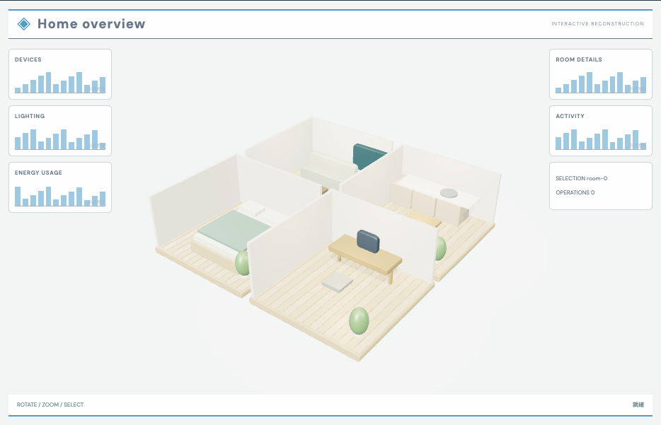

# 智能家居沙盘：外观复现与运行记录

[打开交互实验](https://weisiwu.github.io/threejs-demo/#/demo/smart-home) · [阅读相关文章](https://imgen.baoganai.com/knowledge/read/dilum-x-smart-home)

## 对照原画面

参考画面：浅蓝界面中央的俯视住宅，木地板和浅色家具。

重建四个房间、床、桌、沙发、橱柜与盆栽，灯光跟随房间设备状态。

房型和家具数量未与原作逐件对齐，设备没有接入真实家庭。

[逐项对照记录](../research/appearance-review.json) · [外观代码](../src/visuals/)

## 先看机制

补查作者的 gemini-3-smart-home-app 固定提交后，可见 generateSystemInsight 将房间状态序列化为文字，并请求 gemini-2.5-flash 返回 response.text；该函数没有把模型返回值解析成设备控制对象。

原工程的灯光按钮在 App.tsx 用 setRooms 直接修改房间状态。复现沿用“状态、命令、回执分开”的思路，四个房间有各自灯光与 revision。每次操作为当前房间翻转状态、递增版本，再给出模拟 op-N 确认。

## 如何核对

选择卧室并切换灯光，确认只有该房间的修订号变化；返回客厅后读取它自己的灯光状态。

通用控件可以暂停、推进一秒和重置。推进一秒分为二十次 0.05 秒更新，机构约束与任务状态继续经过同一更新流程。浏览器页签隐藏时不积累缺席时间，自动单步长上限为 0.05 秒。自动绘制上限为每秒 30 次；暂停后，参数、选择、镜头或加载完成才触发新画面。

## 源码入口

- [场景实现](../src/scenes/interfaces.tsx)：按 slug 分支建立部件、处理输入与输出读数。
- [数学与校验](../src/math.ts)：圆交点、逆运动学、FABRIK、网表求解、A*、指令白名单与图重写。
- [运行时](../src/runtime.ts)：单个渲染器、镜头、暂停、拾取、resize 和资源回收。
- [浏览器检查](../tests/browser/experiments.spec.ts)：桌面与 390px 手机加载、操作、参数、暂停和重置；另有网表失败、库存去重、布局持久化与资源切换用例。

页面读数来自当前场景计算。测试范围见 [验证说明](validation.md)；浏览器检查通过不能代替真实设备、科学精度或外部模型调用验收。

## 原资料与复现范围

亮度只改变灯泡材质发光，不是房间照度或真实耗电。没有硬件连接与模型调用；原帖与补查仓库的具体版本对应仍未确认。不能因仓库名含 Gemini 3 就将代码里实际模型改写为 Gemini 3。

设备为本地模拟，不控制真实家电。

原帖文字说明了作者公开展示的方向。后面的仓库用于研究相近机制，除非正文另有说明，不能把它当成该条原帖的完整源码。本轮查看了视频封面并按画面重建。视频播放器未成功加载，完整动作与资产仍未核验。

1. [作者 X 原帖 · 2033950707947286861](https://x.com/DilumSanjaya/status/2033950707947286861)
2. [customizable-react-dashboard-with-charts](https://github.com/dilums/customizable-react-dashboard-with-charts/tree/eac83918b76fe38b931a76a3e9882399663fbc0a)
3. [补查智能家居源码（版本关联未确认）](https://github.com/dilums/gemini-3-smart-home-app/tree/afb8b961c4eaa482507ec72c770afb06df49b28e)
