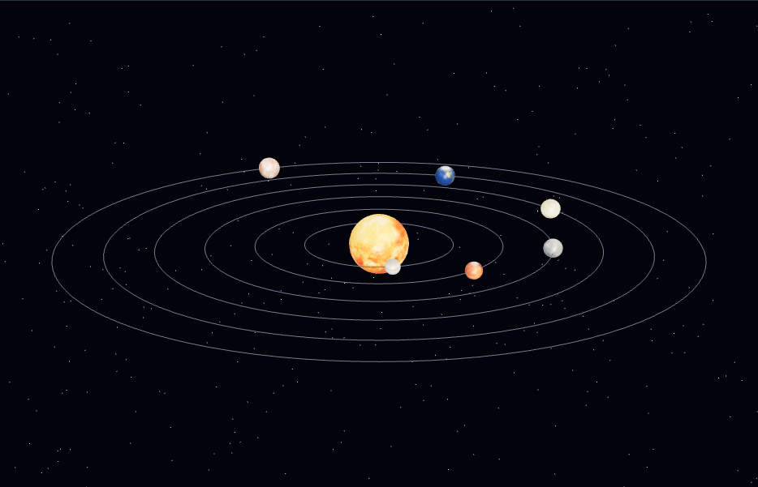

# 太阳系场景搭建：外观复现与运行记录

[打开交互实验](https://weisiwu.github.io/threejs-demo/#/demo/solar-system-basics)

## 对照原画面

参考画面：黑色星空、带纹理的恒星与椭圆轨道。

使用固定源码仓库中的七张纹理，恢复六颗行星和星空背景。

行星随机种子、标签弹窗及尺寸与原工程不完全相同。

[逐项对照记录](../research/appearance-review.json) · [外观代码](../src/visuals/)

## 先看机制

先将 scene、camera、renderer 的职责分清。太阳和六个行星都是程序化网格；轨道线、材质与灯光决定可见性，镜头并不承担天体运动计算。

行星位置使用 x=a cosθ、z=b sinθ，y 固定为 2。每个行星分配 planet-N，轨道与行星共用显示尺度。轨道尺度只改变空间呈现，太阳不随该参数缩放。

## 如何核对

改变轨道尺度并切换轨道线；暂停后拖动相机，星体位置保持，镜头仍可旋转。这里没有真实天文单位或精确星历。

通用控件可以暂停、推进一秒和重置。推进一秒分为二十次 0.05 秒更新，机构约束与任务状态继续经过同一更新流程。浏览器页签隐藏时不积累缺席时间，自动单步长上限为 0.05 秒。自动绘制上限为每秒 30 次；暂停后，参数、选择、镜头或加载完成才触发新画面。

## 源码入口

- [场景实现](../src/scenes/science.ts)：按 slug 分支建立部件、处理输入与输出读数。
- [数学与校验](../src/math.ts)：圆交点、逆运动学、FABRIK、网表求解、A*、指令白名单与图重写。
- [运行时](../src/runtime.ts)：单个渲染器、镜头、暂停、拾取、resize 和资源回收。
- [浏览器检查](../tests/browser/experiments.spec.ts)：桌面与 390px 手机加载、操作、参数、暂停和重置；另有网表失败、库存去重、布局持久化与资源切换用例。

页面读数来自当前场景计算。测试范围见 [验证说明](validation.md)；浏览器检查通过不能代替真实设备、科学精度或外部模型调用验收。

## 原资料与复现范围

运行时用 OrbitControls 处理拖动，ResizeObserver 更新相机宽高比；像素比上限为 1.75。这样可以检查场景是否随容器变化，而不是只在作者截图尺寸下成立。轨道半径与球体尺寸均为展示单位。

行星尺寸、轨道和纹理为展示配置，不是等比例天文模型。

来源包括文章或固定提交源码。复现保留可讨论的机制，界面与几何由本仓库重新实现；原工程依赖、全部资产和部署配置没有直接迁移。

1. [太阳系教程第一篇](https://medium.com/geekculture/build-3d-apps-with-react-animated-solar-system-part-1-c4c394a8574c)
2. [animated-solar-system-with-react-three-fiber](https://github.com/dilums/animated-solar-system-with-react-three-fiber/tree/67518d1f5c1fe52ba3cdf5596969fea9bc9912be)
