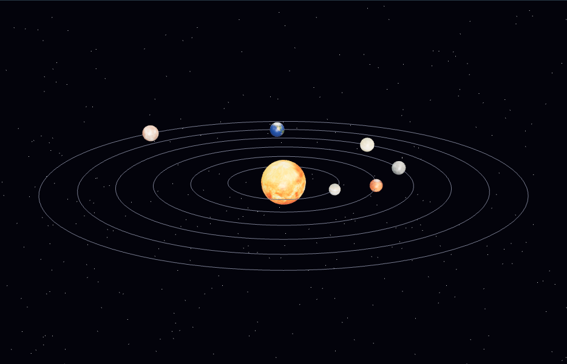

# 轨道与交互：外观复现与运行记录

[打开交互实验](https://weisiwu.github.io/threejs-demo/#/demo/solar-system-orbits)

## 对照原画面

参考画面：同一星空系统，可点选行星读取信息。

恢复纹理球体与椭圆轨道，保留点选和镜头聚焦。

参数表只保留本例实际数据，原文随机生成的物性没有当成真实测量。

[逐项对照记录](../research/appearance-review.json) · [外观代码](../src/visuals/)

## 先看机制

自转与公转是两个角度，不能把父级变换和 mesh 自身旋转混在一个变量里解释。复现先求行星在椭圆上的位置，再单独改 rotation.y。

公转相位按积分 phase += dt×播放倍率推进，各行星除以 1+i×0.5；位置仍为椭圆参数方程。这是匀速参数运动，未按开普勒第二定律修正角速度。轨道形状像椭圆不代表轨道力学已成立。

## 如何核对

先提高倍率，再降到零并推进一秒，确认没有相位跳变。选择另一颗行星后检查镜头目标；移动中的行星不会自动变成持续跟踪镜头。

通用控件可以暂停、推进一秒和重置。推进一秒分为二十次 0.05 秒更新，机构约束与任务状态继续经过同一更新流程。浏览器页签隐藏时不积累缺席时间，自动单步长上限为 0.05 秒。自动绘制上限为每秒 30 次；暂停后，参数、选择、镜头或加载完成才触发新画面。

## 源码入口

- [场景实现](../src/scenes/science.ts)：按 slug 分支建立部件、处理输入与输出读数。
- [数学与校验](../src/math.ts)：圆交点、逆运动学、FABRIK、网表求解、A*、指令白名单与图重写。
- [运行时](../src/runtime.ts)：单个渲染器、镜头、暂停、拾取、resize 和资源回收。
- [浏览器检查](../tests/browser/experiments.spec.ts)：桌面与 390px 手机加载、操作、参数、暂停和重置；另有网表失败、库存去重、布局持久化与资源切换用例。

页面读数来自当前场景计算。测试范围见 [验证说明](validation.md)；浏览器检查通过不能代替真实设备、科学精度或外部模型调用验收。

## 原资料与复现范围

聚焦按钮循环选择稳定行星 ID，镜头目标跟随所选位置的当前快照。播放倍率可以降至零，且改倍率不会重置先前相位。重置会重新建立同一初始相位。

这是动画机制复现；未进行真实轨道数值积分。

来源包括文章或固定提交源码。复现保留可讨论的机制，界面与几何由本仓库重新实现；原工程依赖、全部资产和部署配置没有直接迁移。

1. [太阳系教程第二篇](https://medium.com/geekculture/build-3d-apps-with-react-animated-solar-system-part-2-1186a5c8bd1)
2. [animated-solar-system-with-react-three-fiber](https://github.com/dilums/animated-solar-system-with-react-three-fiber/tree/67518d1f5c1fe52ba3cdf5596969fea9bc9912be)
