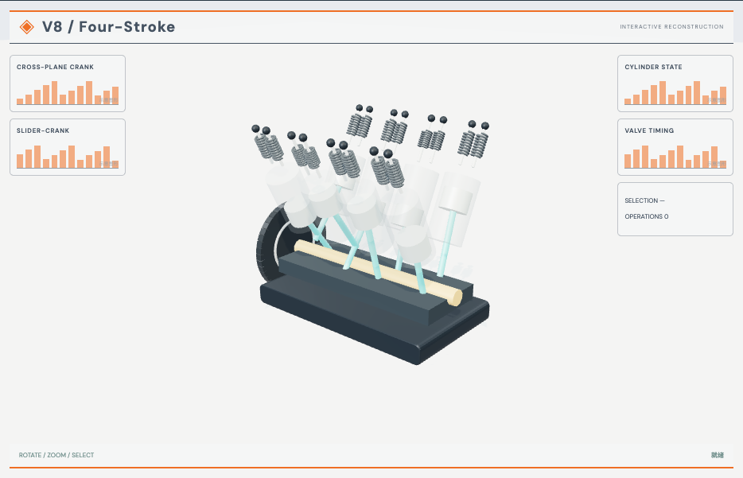

# V8 曲柄连杆：外观复现与运行记录

[打开交互实验](https://weisiwu.github.io/threejs-demo/#/demo/v8-engine) · [阅读相关文章](https://imgen.baoganai.com/knowledge/read/dilum-x-v8-engine)

## 对照原画面

参考画面：浅色机械工作台，黑色 V8 机架、活塞和顶部气门弹簧。

补齐飞轮、气缸衬套和十六组弹簧，沿用八缸曲柄滑块运动。

凸轮、配气正时和飞轮齿形尚未与原作完全对齐。

[逐项对照记录](../research/appearance-review.json) · [外观代码](../src/visuals/)

## 先看机制

活塞运动采用曲柄滑块公式：s=r cosθ+sqrt(l²-r²sin²θ)。r=0.45，l=1.8，八个气缸共享驱动相位并配置相位偏移。

两侧气缸轴向为归一化 (0,1,±0.5)，曲柄销在该轴与垂直向量形成的平面内计算。连杆端点分别取曲柄销和滑块位置，再测量两点距离与 1.8 的差。这样能真正检查倾斜装配，而不是将同一公式相减后报告零。

## 如何核对

打开剖面并减速，逐步推进观察八组相位；两侧连杆长度残差都应接近浮点误差。

通用控件可以暂停、推进一秒和重置。推进一秒分为二十次 0.05 秒更新，机构约束与任务状态继续经过同一更新流程。浏览器页签隐藏时不积累缺席时间，自动单步长上限为 0.05 秒。自动绘制上限为每秒 30 次；暂停后，参数、选择、镜头或加载完成才触发新画面。

## 源码入口

- [场景实现](../src/scenes/mechanics.ts)：按 slug 分支建立部件、处理输入与输出读数。
- [数学与校验](../src/math.ts)：圆交点、逆运动学、FABRIK、网表求解、A*、指令白名单与图重写。
- [运行时](../src/runtime.ts)：单个渲染器、镜头、暂停、拾取、resize 和资源回收。
- [浏览器检查](../tests/browser/experiments.spec.ts)：桌面与 390px 手机加载、操作、参数、暂停和重置；另有网表失败、库存去重、布局持久化与资源切换用例。

页面读数来自当前场景计算。测试范围见 [验证说明](validation.md)；浏览器检查通过不能代替真实设备、科学精度或外部模型调用验收。

## 原资料与复现范围

这是八组曲柄滑块的展示，不是完整共轴 V8 曲轴、点火顺序、配气和燃烧模拟。RPM 是展示驱动速率，未给出真实扭矩、振动与机械效率。

八缸运动学示意，无燃烧、扭矩或真实机型点火表。

原帖文字说明了作者公开展示的方向。后面的仓库用于研究相近机制，除非正文另有说明，不能把它当成该条原帖的完整源码。本轮查看了视频封面并按画面重建。视频播放器未成功加载，完整动作与资产仍未核验。

1. [作者 X 原帖 · 2096280244663775423](https://x.com/DilumSanjaya/status/2096280244663775423)
2. [responsive-strandbeest](https://github.com/dilums/responsive-strandbeest/tree/4eb0e454bb4d089de4c40da21f51c4efacad4e24)
