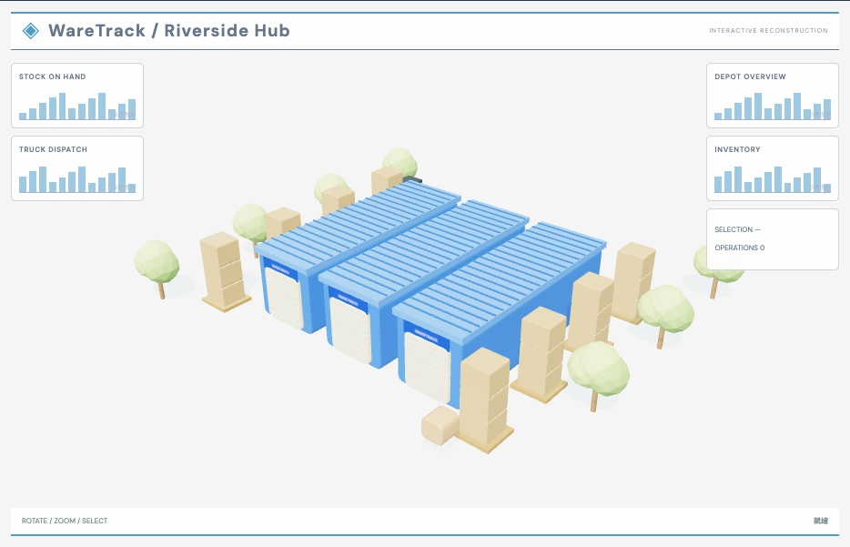

# 仓库搬运策略：外观复现与运行记录

[打开交互实验](https://weisiwu.github.io/threejs-demo/#/demo/warehouse-strategy) · [阅读相关文章](https://imgen.baoganai.com/knowledge/read/dilum-x-warehouse-game)

## 对照原画面

参考画面：浅蓝管理页面中的蓝色仓房、纸箱、黄叉车和绿树。

重建仓房、卷帘门、瓦楞屋顶、货堆与叉车，保留寻路和库存去重。

建筑布局与原作不同，原片装卸与多车调度没有全部实现。

[逐项对照记录](../research/appearance-review.json) · [外观代码](../src/visuals/)

## 先看机制

仓库把世界分成 12×12 网格，三列货架占据明确格子。A* 使用四邻域、单位边代价与曼哈顿启发式，路径禁止穿过货架或边界。

任务先预约货物，到 (11,11) 取货，再规划到 (0,11) 卸货。机器人沿格段插值移动，货物在送货段跟随机器人。完成集合按 task-ID 去重，只有到达卸货点才增加库存并释放预约。

## 如何核对

连续派单两次应提示重复；暂停后推进十五秒，默认速度下送达库存为 1。继续推进不会二次结算同一个任务。

通用控件可以暂停、推进一秒和重置。推进一秒分为二十次 0.05 秒更新，机构约束与任务状态继续经过同一更新流程。浏览器页签隐藏时不积累缺席时间，自动单步长上限为 0.05 秒。自动绘制上限为每秒 30 次；暂停后，参数、选择、镜头或加载完成才触发新画面。

## 源码入口

- [场景实现](../src/scenes/spaces.ts)：按 slug 分支建立部件、处理输入与输出读数。
- [数学与校验](../src/math.ts)：圆交点、逆运动学、FABRIK、网表求解、A*、指令白名单与图重写。
- [运行时](../src/runtime.ts)：单个渲染器、镜头、暂停、拾取、resize 和资源回收。
- [浏览器检查](../tests/browser/experiments.spec.ts)：桌面与 390px 手机加载、操作、参数、暂停和重置；另有网表失败、库存去重、布局持久化与资源切换用例。

页面读数来自当前场景计算。测试范围见 [验证说明](validation.md)；浏览器检查通过不能代替真实设备、科学精度或外部模型调用验收。

## 原资料与复现范围

已有任务时重复命令不派新单，路径失败保留库存。它是单机器人、单货物的事务演示，没有多机器人调度、碰撞协商或实际仓储接口。场景像仓库与库存正确是两个需要分别验证的问题。

小规模本地游戏原型，不是生产仓储调度系统。

原帖文字说明了作者公开展示的方向。后面的仓库用于研究相近机制，除非正文另有说明，不能把它当成该条原帖的完整源码。本轮查看了视频封面并按画面重建。视频播放器未成功加载，完整动作与资产仍未核验。

1. [作者 X 原帖 · 2106426962738880879](https://x.com/DilumSanjaya/status/2106426962738880879)
2. [customizable-react-dashboard-with-charts](https://github.com/dilums/customizable-react-dashboard-with-charts/tree/eac83918b76fe38b931a76a3e9882399663fbc0a)
