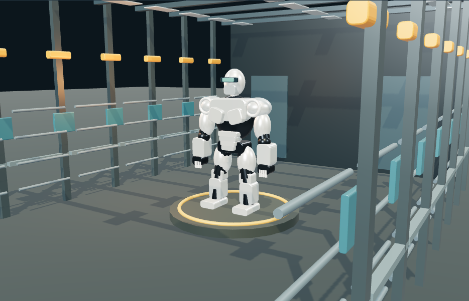

# 三维地形探索：外观复现与运行记录

[打开交互实验](https://weisiwu.github.io/threejs-demo/#/demo/world-environment) · [阅读相关文章](https://imgen.baoganai.com/knowledge/read/dilum-x-world-environment)

## 对照原画面

参考画面：工业舱室中的银色机器人，橙色灯、管线和金属墙。

撤去森林，重建舱室、工作台、管线与机器人。

没有原作高分辨率环境贴图；移动仍为本例碰撞沙盘。

[逐项对照记录](../research/appearance-review.json) · [外观代码](../src/visuals/)

## 先看机制

生成环境进入玩法前，要建立可查询的地面与障碍。本例用同一高度函数 h(x,z)=sin(0.55x)cos(0.4z)×幅度生成网格并采样角色脚底。

角色使用 WASD 或方向键移动，边界限定在 ±7.4。十六棵树各有半径 0.7 的碰撞代理；尝试移动时先查代理，再更新角色位置。修改地形幅度后，树根与角色重新采样高度。

## 如何核对

移动到边界与树旁，检查越界和穿树；站定后提高地形幅度，角色 y 应跟随同一高度函数。

通用控件可以暂停、推进一秒和重置。推进一秒分为二十次 0.05 秒更新，机构约束与任务状态继续经过同一更新流程。浏览器页签隐藏时不积累缺席时间，自动单步长上限为 0.05 秒。自动绘制上限为每秒 30 次；暂停后，参数、选择、镜头或加载完成才触发新画面。

## 源码入口

- [场景实现](../src/scenes/spaces.ts)：按 slug 分支建立部件、处理输入与输出读数。
- [数学与校验](../src/math.ts)：圆交点、逆运动学、FABRIK、网表求解、A*、指令白名单与图重写。
- [运行时](../src/runtime.ts)：单个渲染器、镜头、暂停、拾取、resize 和资源回收。
- [浏览器检查](../tests/browser/experiments.spec.ts)：桌面与 390px 手机加载、操作、参数、暂停和重置；另有网表失败、库存去重、布局持久化与资源切换用例。

页面读数来自当前场景计算。测试范围见 [验证说明](validation.md)；浏览器检查通过不能代替真实设备、科学精度或外部模型调用验收。

## 原资料与复现范围

昼夜操作只切换地形色调，没有太阳轨迹或照度模拟。World Labs 与 Hunyuan3D 没有在本例调用；程序化地形用来验证控制链路。若换成高斯场或三角网格，碰撞与高度查询需要重新提供。

未调用 World Labs 或 Hunyuan3D；环境是确定性程序化场景。

原帖文字说明了作者公开展示的方向。后面的仓库用于研究相近机制，除非正文另有说明，不能把它当成该条原帖的完整源码。本轮查看了视频封面并按画面重建。视频播放器未成功加载，完整动作与资产仍未核验。

1. [作者 X 原帖 · 2028877095968117240](https://x.com/DilumSanjaya/status/2028877095968117240)
2. [aisdk-threejs-starter](https://github.com/dilums/aisdk-threejs-starter/tree/8b182dc5314fc622e61f262fc6bc0301bc31e2c3)
